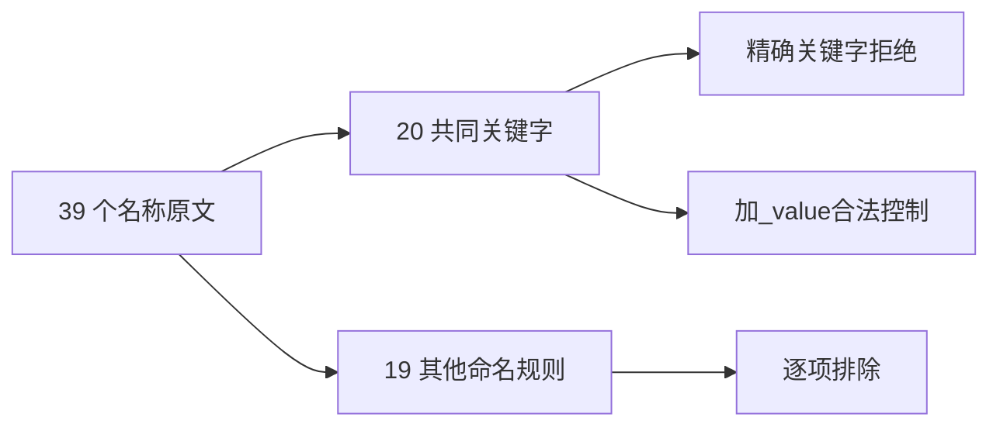
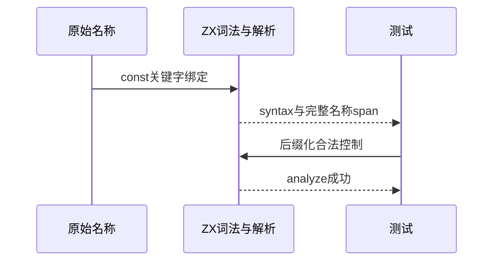

# Test262 保留字绑定边界验证

## Intent：最终目标

阶段三百二十七：验证ZX与JavaScript共同保留的普通名称，并明确双方关键字集合差异。

## Data：可用证据

逐项读取39个未转义val原文；20个名称也是ZX关键字，19个属于其他情况（JS关键字在ZX可作值名、ZX专用保留名或命名限制）。ZX关键字表位于packages/core/src/syntax.zig。

## Edges：边界与限制

20项可保留名称核对parse/syntax，另为每个名称加_value后缀作为合法控制。19项不能把不同的命名或分析拒绝当作原文关键字规则，按实际语义排除。原文yield仅严格模式解析，参考执行遵守flags。

## Answer：交付格式与成功标准

新增20精确拒绝与20合法前端控制。39原文哈希和参考核验、生成器重复性、矩阵与前端专项通过。不同关键字集合不通过扩充生产保留字来强行对齐。

## 自我复核

不把所有JS保留字都假设成ZX关键字；探针检查其余名称的实际行为，原文与本地控制分别计数。

## 验证结果

运行 `zig build test-frontend --summary all`：5/5步骤、5305/5305测试通过，本阶段新增40项（20拒绝和20合法控制）。39原文哈希与正文核验、4次参考正常执行及73次解析拒绝通过，yield按onlyStrict处理。生成器重复性、矩阵、格式及diff检查通过。

其余19名称的真实CLI探针中16个成功生成；美元和单下划线因naming拒绝，in因专用绑定name约束拒绝，均未冒充原文关键字规则。

JSONL65074（frontend5305），上游已审阅1958=678 adapted+103 equivalent+1177 excluded，未审阅51639，关联4916。未改生产实现、未发现需报告缺陷、未通知实现聊天、未重跑完整根回归。
