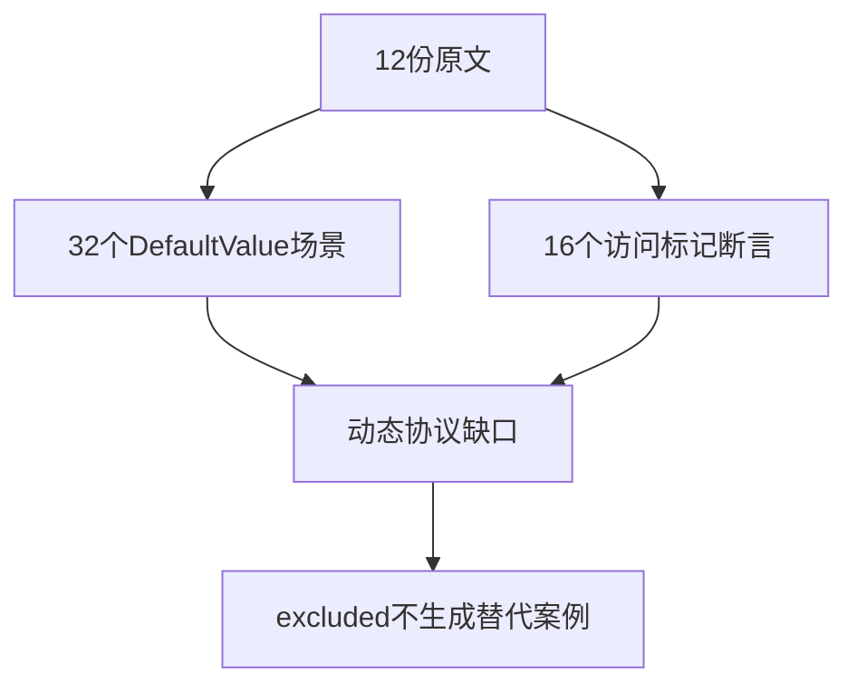
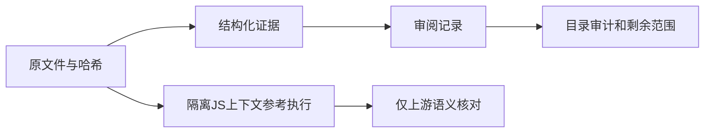

# Test262关系动态转换协议审阅

## Intent：最终目标

逐项识别关系比较剩余的DefaultValue和转换副作用协议，保留真实未支持边界，不用显式调用模拟隐式协议来增加通过数。

## Data：可用证据

固定Test262提交7ab7fafa0003f73fc85c1b95d88094d33f7eb8bd。完整阅读四份A2.2_T1与greater-than/less-than-or-equal各四份11.8.x文件，共12份。前者32个协议场景，后者16个sameValue断言。原始哈希、六个正常条件及两个抛错表达式、左右转换方法/数值/断言均保存在同目录审阅证据中。

## Edges：边界与限制

本批实际是普通对象，不包含Date。ZX没有动态ToPrimitive协议与闭包捕获外部可变变量，因此12份均excluded。JS参考执行只核对上游原文，不能计为ZX通过，也不能增加用例目录数量。

## Answer：交付格式与成功标准

12条带哈希与具体原因的excluded审阅，独立执行原JS核验上游断言，目录审计无重复或失效关联。后续关系比较剩余文件应全部是BigInt家族。

## 执行结果

新增12条excluded审阅。四份A2.2各8个协议场景：正常valueOf结果优先，即使toString返回对象或会抛错也不调用；valueOf不能给出原始值时回退toString；valueOf抛错立即传播；两次返回对象则TypeError。错误提示中的1与执行体0/2存在差异，证据按实际条件保留。

八份ES5访问标记文件各两个sameValue断言。greater使用3>4得到false，less_equal使用4<=2得到false；valueOf/toString四种组合都要求左侧设置accessed=true。这只能证明左侧转换发生，不足以证明完整左右顺序，因此没有扩大其覆盖描述。

`node 原文验证.mjs`逐文件创建独立上下文，提供Test262Error和sameValue断言，设置1秒执行上限，全部12份参考执行通过。日志 `/tmp/zxc-relational-protocols-reference.log`。这些是JS原文核对，不是新增ZX用例或ZX通过结果。

目录审计通过，日志 `/tmp/zxc-relational-protocols-audit.log`。目录63323与关联3829不变；上游633/53597（425 adapted、103 equivalent、105 excluded），未审阅52964。原文证据与正式审阅记录逐字节一致，diff通过。

重新枚举四个目录：less-than剩8、greater-than剩8、less-than-or-equal剩6、greater-than-or-equal剩6，共28份，全部BigInt文件。列表保存为审阅证据目录中的剩余文件.json；这只是上述四个目录的剩余范围，不代表全Test262只剩28份。

## 自我批判

本轮完善的是已知覆盖边界，没有实现动态转换，也没有增加ZX通过案例。参考JS执行帮助发现转录或原预期理解错误，不能替代目标语言执行。accessed布尔标记不记录调用次数或完整顺序，不能宣传为强顺序保证。

此前开场提及Date是选题时的假设，实际读取本批原文后确认没有Date，已按事实收窄记录。无生产修改、未重复运行无改动的ZX套件，也不据此清除既有失败。
