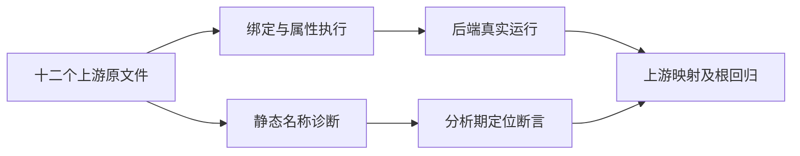
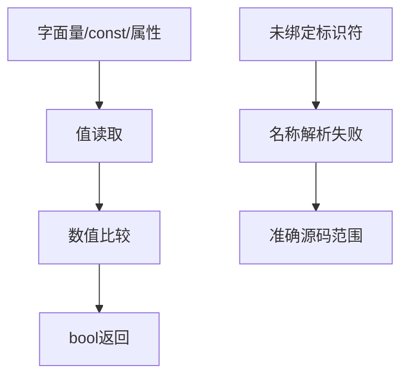

# Test262 关系名称解析验证

## Intent：最终目标

完成四种关系运算的已绑定值读取、属性读取和未绑定名称边界验证，并以完整根回归复核最近语言与工具链新增测试的集成。

## Data：可用证据

已逐项读取四组 S11.8.x_A2.1_T1/T2/T3，共十二个原文件。T1 分别覆盖字面量、左绑定、右绑定、双绑定与属性；T2/T3 是未绑定左右名称的 ReferenceError。沿用 generate_multiplication_names.ts 的真实前端和执行模式。

## Edges：边界与限制

ZX 使用 const 和静态对象代替 var/new Object/后续赋值，保留值读取结果；未绑定名称在分析期报 name，不提供运行期 ReferenceError。运行数据不只用原真值，还用逆序与相等值防止恒真实现蒙混通过。

## Answer：交付与成功标准

每种运算独立验证五种表达式形态，字面量一例、其余形态三个输入；前端覆盖左右名称未绑定/已绑定和双未绑定的定位。关联十二个上游文件的完整断言，运行专项与真实 Z3 完整根。

## 执行结果与自我批判

新增 52 个执行案例与 20 个前端案例，共 72 个。每种关系运算的原五种读取方式都有对应执行；已绑定左右名称接受，未绑定左右及双未绑定均验证 name 与精确源码范围。原 var/动态对象写入使用 const/静态对象初始化适配，十二个原文件逐项读取并校验 SHA-256，新增 12 adapted。

前端与普通执行专项 **880/880 步骤、45,793/45,793 测试通过**，日志 `/tmp/zxc-relational-names.log`。TypeScript、生成一致性、目录审计、格式与 diff 检查通过。无生产源码修改或新实现缺陷。

累计登记 57,703：runtime 42,600、frontend 3,193、evaluation_order 764、safety 464、module_graphs 10,446、stores 236。上游已审阅 328/53,597（193 adapted、102 equivalent、33 excluded），未审阅 53,269，唯一关联 1,417。

自我批判：分析期 name 拒绝与运行期 ReferenceError 是不同失败模型，测试不能证明异常捕获机制；静态属性读取也不等于动态属性赋值已实现。为避免只验证原始 true 结果，绑定和属性形态补入逆序与零相等数据。完整根回归采用真实 Z3：`ZXC_TEST_SOLVER=/tmp/zxc-z3-5.1.0/z3-5.1.0-x64-osx-13.3/bin/z3 zig build test --summary all`，退出码 0，**1,106/1,106 步骤、57,705/57,705 Zig 测试通过**。八组包管理、索引与工具链 Node 报告合计 **1,750/1,750**（含工具链生命周期父容器），日志 `/tmp/zxc-stage90-root.log`。本次完整根覆盖最近加入的原生清单、独立工具链和并发解包测试，替代阶段 83 成为本会话最新根回归证据。
