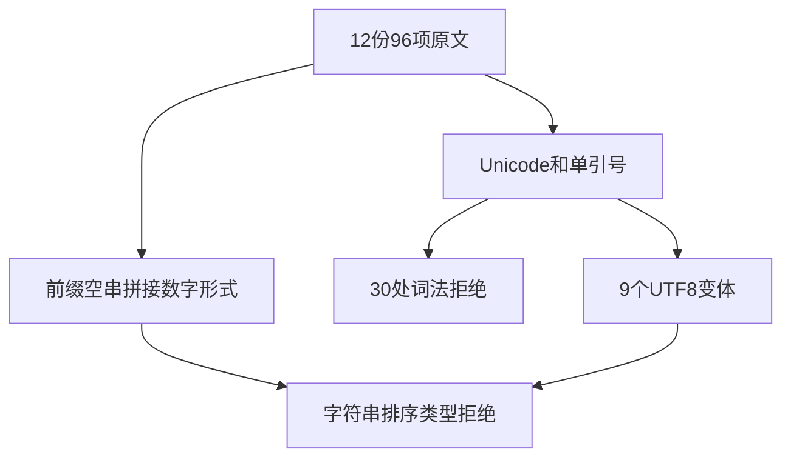
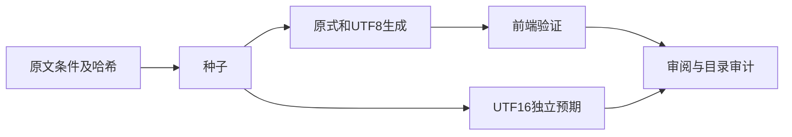

# Test262关系字符串排序边界验证

## Intent：最终目标

补齐大于、小于等于和大于等于的字符串前缀、字典序和Unicode边界审阅，与此前小于比较覆盖对齐。

## Data：可用证据

固定Test262提交7ab7fafa0003f73fc85c1b95d88094d33f7eb8bd。完整阅读三种运算符各A4.10、A4.11、A4.12_T1/T2共12份96项原文。原文包含3处单引号'y'；实际条件为权威，不从错误提示字符串抽取。原生ZX词法仅接受双引号以及有限转义。

## Edges：边界与限制

ZX字符串没有关系排序，原式只能验证词法或类型拒绝。保留单引号和Unicode转义，不悄悄改写以绕过词法边界。对9个含码点转义的有效Unicode标量对另加真实UTF8变体，分辨转义拒绝和类型拒绝。JS独立预期按UTF16代码单元排序，不能用Unicode码点排序代替。

## Answer：交付格式与成功标准

96原式+9UTF8变体共105前端用例，12条adapted审阅；原式字节、哈希、JS布尔结果及词法跨度独立核验，实际前端专项通过。

## 执行结果

新增105项（96个原式+9个真实UTF8变体），三种运算符各35项。30项词法拒绝含27个Unicode转义原式和3个单引号原式，75项类型拒绝含66个其余原式和9个UTF8变体。单引号'y'未静默改成双引号；所有条件按if表达式抽取，不依赖可能有笔误的错误提示文本。

`zig build test-frontend -Dfrontend-filter=relational_string_order --summary all` 退出0，5/5步骤、105/105通过，日志 `/tmp/zxc-relational-string-order.log`。

独立脚本核对12个哈希、96个原始表达式和JS布尔结果、30个准确词法跨度及9个真实UTF8变体。JS字符串比较使用UTF16代码单元序列，包含代理项和补充平面字符；例如U+10000与U+FFFF的相对顺序不能用Unicode码点大小替代。日志 `/tmp/zxc-relational-string-order-review.log` 通过。

TypeScript、生成--check、目录审计、格式、zig fmt、diff及6份草稿一致性通过。目录63323，前端4768、普通运行46565不变；上游621/53597（425 adapted、103 equivalent、93 excluded），未审阅52976、关联3829。审计日志 `/tmp/zxc-relational-string-order-audit.log`。无生产修改或新缺陷。

## 自我批判

UTF8变体的类型拒绝仅说明词法输入通过后排序仍不支持，并非实现了UTF16比较。拼接表达式可能先因字符串加法被拒绝，也不能仅凭最终type_mismatch推断一定到达关系运算分析。原式和变体分别计数，未把所有原Unicode转义替换成有效字符来掩盖词法差异。

本轮没有运行语义新增，也没有完整根回归。此前小于比较已有独立覆盖，未重计其案例；A2.2、BigInt及其他未审阅文件仍需继续。
