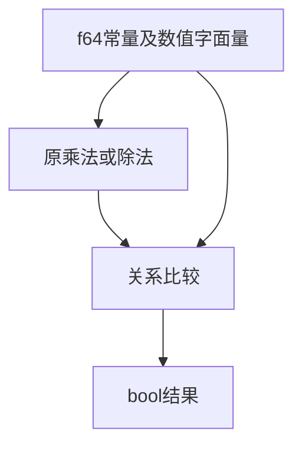

# Test262 关系数值原式验证

## Intent：最终目标

逐项验证四个 A4.9 上游文件中的八条有限数值比较，保留原操作数及 MAX_VALUE/2、MIN_VALUE*2 的运算结构。

## Data：可用证据

已读取 <、>、<=、>= 的 S11.8.x_A4.9.js，每个八条断言。现有 IEEE 矩阵覆盖极值输入，但不能直接证明源码中的字面量、除法/乘法与比较组合。

## Edges：边界与限制

使用 f64 最大有限值 1.7976931348623157e308 与最小正次正规值 5e-324，替代不提供的 Number 全局常量。期望布尔值逐条来自原断言，不调用被测实现生成期望。本轮不覆盖字符串顺序或动态 Number 包装。

## Answer：交付与成功标准

新增 32 个源表达式执行案例，真实编译器及后端执行。四文件校验哈希并关联完整八项断言；类型、生成一致性、目录审计与执行专项通过。

## 执行结果与自我批判

新增 32 个执行案例，原四文件分别完整对应八个布尔断言；四个原文件 SHA-256 与锁定索引一致，新增 4 adapted。最大/最小值保留 f64 类型及原 /2、*2 结构，没有仅用预先算好的输入代替原式。

普通执行专项 **857/857 步骤、42,548/42,548 测试通过**，退出码 0，日志 `/tmp/zxc-relational-source.log`。TypeScript、生成一致性、目录审计、Zig 格式和 diff 检查通过，无生产修改或新实现缺陷。

累计 57,596 登记案例：runtime 42,548、frontend 3,138、evaluation_order 764、safety 464、module_graphs 10,446、stores 236。上游审阅 312/53,597（177 adapted、102 equivalent、33 excluded），剩余 53,285，唯一关联案例 1,310。最近完整根为阶段 83，本轮未重复整仓回归。

自我批判：这些常量表达式允许编译器进行常量折叠，因此其证明范围是源码数值语义及生成执行的整体结果；动态输入的位级比较仍由既有 IEEE 矩阵验证。以显式 f64 常量替代 Number 属性意味着源码环境不同，因此标为 adapted，未标 equivalent。
