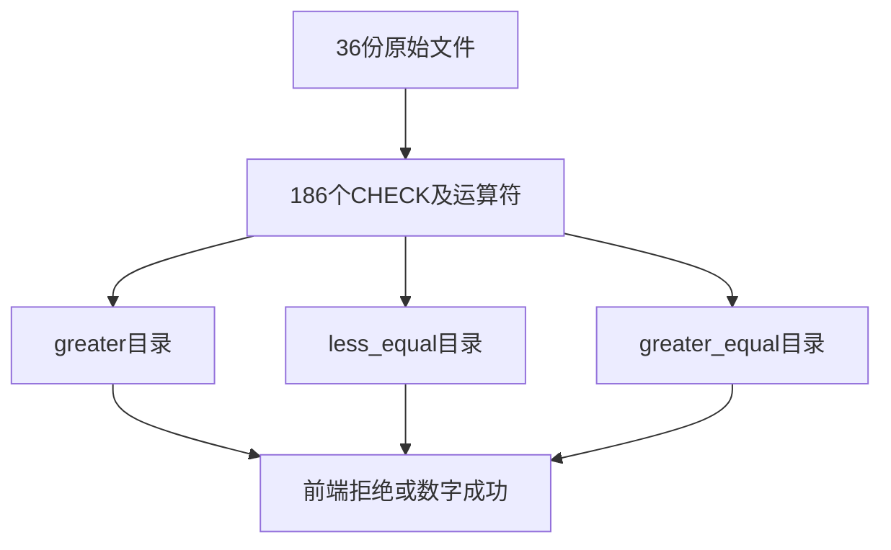

# Test262关系比较转换边界验证

## Intent：最终目标

继续逐项对齐大于、小于等于和大于等于的A3.1转换原文，保留实际表达式及预期，补齐三种关系运算符的ZX静态边界。

## Data：可用证据

固定Test262提交7ab7fafa0003f73fc85c1b95d88094d33f7eb8bd。三类各12份文件、62个CHECK，共36份186项。已经完整阅读原文，包含bool/number包装对象、null/undefined、混合字符串与数字等。原结果随运算符不同：null>=null及null<=null为true，而带undefined的比较仍false。

## Edges：边界与限制

这些转换边界并非JS等价实现：ZX拒绝包装对象及非数值隐式转换。三项普通数字比较分别关联已有运行测试，其他项验证明确拒绝。小于比较上一轮62项保持独立，不复制计算成新案例。

## Answer：交付格式与成功标准

新增按三种运算符目录分类的186个前端测试，36条adapted审阅；核对36个哈希、186条表达式及原结果。联合现有关系空白运行专项验证三个数字控制，生成一致性、类型检查、覆盖审计和草稿一致性通过。

## 执行计划

以已成熟的小于比较生成器为本地风格样例，按新种子的实际操作数分类；三个数值控制复用已有用例。所有原CHECK逐项保留，不通过改变运算符来套用上一轮结果。

## 执行结果

36份原文186项全部保留，按greater、less_equal、greater_equal三个目录各62项分类。新增前端结果：108项parse/syntax、51项analyze/type_mismatch、24项analyze/name、3项数字比较成功。数字控制分别为1>1得到false、1<=1和1>=1得到true，关联已有对应tab/left/1运行案例。

命令 `zig build test-frontend test-relational-whitespace -Dfrontend-filter=relational_conversion --summary all` 退出0，17/17步骤、402/402 Zig通过（新增186+既有216）。日志 `/tmp/zxc-relational-conversion.log`。旧216项不计为本轮新增。

独立校验脚本核对36个原文哈希、186个表达式与原JS结果、186项分类及三个运行控制的输入和源码分支，日志 `/tmp/zxc-relational-conversion-review.log` 通过。有限转换解释器直接使用>、<=、>=分别计算，undefined转NaN后关系比较为false，避免将<=错误地当作>结果的简单取反。该解释器只针对已阅读的有限数据，不是通用JS实现。

TypeScript、生成--check、目录审计、格式、zig fmt、diff及6份草稿一致性通过。目录63178，前端4623、运行46565；上游585/53597（397 adapted、103 equivalent、85 excluded），未审阅53012、唯一关联3684。审计日志 `/tmp/zxc-relational-conversion-audit.log`。没有生产修改或新实现缺陷。

## 自我批判

静态拒绝和JS隐式转换是不同契约，本轮登记adapted不登记equivalent。完整读到这些CHECK不代表覆盖关系运算符的所有动态对象协议、BigInt或异常顺序；A3.1之外仍有未审阅文件。语法/类型拒绝也不证明返回值符合JS预期，只有三个数字控制在本轮关联了等价数值结果。

本轮增加186项，不能把联合执行的216项再次累加。全量测试包和仓库根没有重跑，四项legacy身份失败的历史状态未改变。
