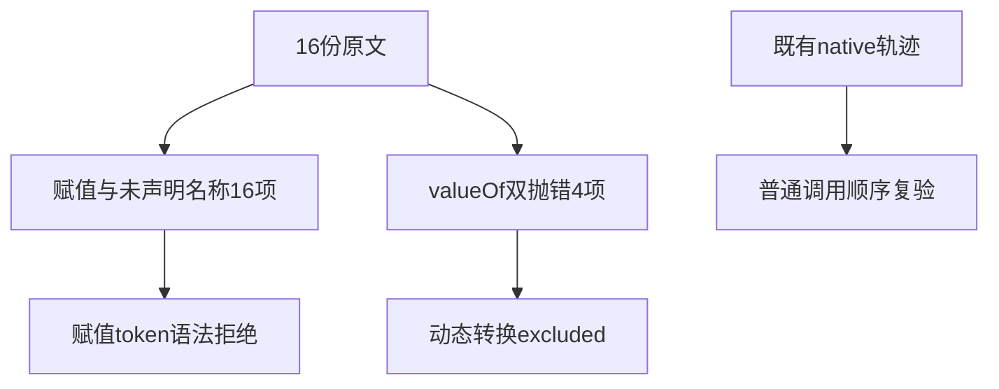
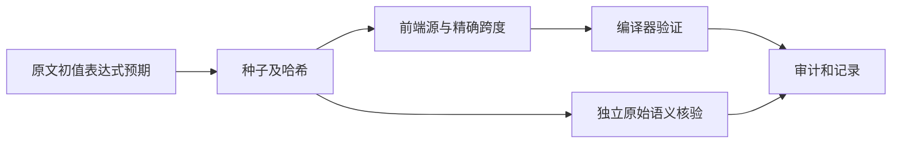

# Test262关系求值顺序边界审阅

## Intent：最终目标

区分关系运算符的操作数求值与动态转换求值，按原文保留赋值表达式、未声明名称和异常优先级边界。

## Data：可用证据

完整读取四种运算符A2.3_T1、A2.4_T1/T3/T4共16份原文20个场景。A2.3依赖valueOf抛错；A2.4_T1是左右赋值顺序，T3是先读未声明x导致ReferenceError，T4依赖noStrict隐式全局y。greater A2.3描述提到<，实际语句为x>y，按实际源码处理。

## Edges：边界与限制

ZX不支持赋值表达式、隐式全局及动态valueOf协议。A2.4以赋值token的解析期拒绝适配，不声称运行时ReferenceError顺序等价；A2.3登记excluded。既有432条关系运算native调用轨迹只证明普通调用/失败顺序，不替代动态转换协议。

## Answer：交付格式与成功标准

新增16个含精确赋值token跨度的前端用例，12条adapted及4条excluded。复跑真实调用轨迹专项，分别记录新案例与既有回归，不混算数量。

## 执行结果

新增16个parse/syntax前端用例，保留四种关系运算符的原初值、左右赋值排列及未声明名称表达式，精确定位单字节=，不会把>=或<=中的等号当作赋值token。

命令 `zig build test-frontend test-evaluation-order -Dfrontend-filter=relational_assignment --summary all` 退出0，54/54步骤、861/861 Zig通过。日志 `/tmp/zxc-relational-assignment.log`。其中16项为本轮新增，844项为既有目录化轨迹案例，另1项是原有轨迹基础测试；包括432项关系比较调用/失败顺序回归。没有将既有845项计作新增。

四份A2.3 valueOf抛错协议各1个场景登记excluded，原要求先传播x而不是y。十二份A2.4登记adapted：语法拒绝发生在赋值表达式，不代表实现了原来的赋值运行结果、隐式全局或ReferenceError。

独立原文校验核对16个SHA256、20个场景、所有赋值初值与JS预期，以及16处精确token跨度。有限求值器严格先算左操作数，再算右操作数；不执行JS或从zxc输出反推预期。日志 `/tmp/zxc-relational-assignment-review.log` 通过。TypeScript、生成--check、目录审计、格式、zig fmt、diff及4份草稿一致性通过。

目录63218，前端4663、普通运行46565、目录化轨迹844；上游609/53597（413 adapted、103 equivalent、93 excluded），未审阅52988、关联3724。审计日志 `/tmp/zxc-relational-assignment-audit.log`。没有生产修改或新缺陷。

## 自我批判

ToNumber/valueOf异常顺序与原操作数调用顺序是不同阶段；已有native双失败的正确轨迹不能证明隐式转换协议。同样，ZX在解析期拒绝x<(x=1)，并没有运行到未声明x，不能称为正确传播ReferenceError。

本轮扩大了既有轨迹回归范围，但它仍不是完整测试包或仓库根回归；四项legacy身份失败状态不变。A2.2动态转换协议及BigInt等原文仍有未审阅内容。
