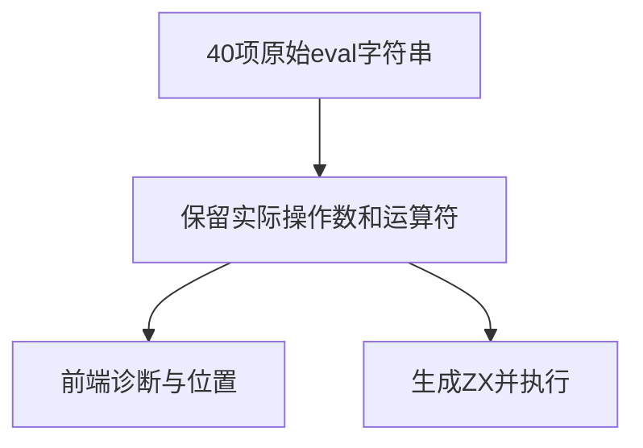
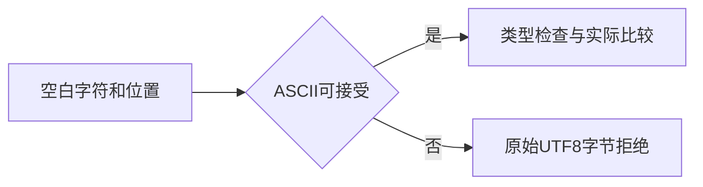

# Test262关系运算空白边界验证

## Intent：最终目标

逐项对齐四种关系运算符A1的40条原文表达式，并扩展左右空白位置、静态类型拒绝和实际数值运行。

## Data：可用证据

固定Test262四份原文与哈希；现有加法空白生成器作为同职责样例。greater-than第10条实际是1>=1，less-than-or-equal第10条实际是1>0，保留这两处原始表达式。

## Edges：边界与限制

ZX只接受ASCII词法空白；NBSP、Unicode行/段分隔符及组合中的第一个不支持字节应在词法阶段拒绝。这是adapted差异，不宣称原JS全部通过。不引入eval实现。

## Answer：交付格式与成功标准

原文数据、生成器、前端和运行目录、四条审阅及独立核验。前端检查阶段/字节位置，执行案例用0/1/2三种输入验证关系结果。专项接入根构建与生成一致性检查。

## 执行结果

新增456个登记案例：240个前端案例（72正常分析、72混合类型拒绝、96词法拒绝）和216个真实生成代码运行案例。每种原始空白分别放在运算符左、右或两侧；运行输入0/1/2覆盖小于、等于和大于右侧1的三种关系。

四份原文共40条eval字符串全部保留实际操作数和运算符，独立核对数值预期；greater-than组合项1>=1及less-than-or-equal组合项1>0没有被机械改写。新增4条adapted审阅，每条关联114个本地案例。Unicode空白拒绝明确记为ZX契约差异，而不是JS原例通过。

执行 `zig build test-frontend test-relational-whitespace -Dfrontend-filter=relational_whitespace --summary all` 首轮退出0，**17/17步骤、456/456测试通过**，日志 `/tmp/zxc-relational-whitespace.log`。新运行专项及生成器--check已接入根构建，种子数据也登记为生成器输入。

独立核验脚本 `关系运算空白测试草稿/原文校验.py` 检查4份哈希、40条原表达式、2处跨运算符、240个前端预期/UTF8字节位置以及216项整数关系参考结果，日志 `/tmp/zxc-relational-whitespace-review.log`。TypeScript、生成一致性、审计、Zig格式、diff与6份源码/数据草稿一致性通过。

目录62,930：前端4,375、普通运行46,565、轨迹844、安全464、模块10,446、Store236。上游审阅537/53,597（349 adapted、103 equivalent、85 excluded），未审阅53,060，唯一关联3,436。审计与TS日志 `/tmp/zxc-relational-whitespace-audit.log`、`/tmp/zxc-relational-whitespace-typecheck.log`。

本轮无生产修改或新增实现缺陷。原生包对象ABI两条失败仍由实现会话处理，此轮未重跑；最后已验证结果仍为阶段178的1过2失败。最新完整根仍阶段170，不以新专项代替完整根。

## 自我批判

目录名称不是表达式真值来源，原文中的跨运算符案例必须保留。静态拒绝与原始JS执行的差异必须单独说明。
