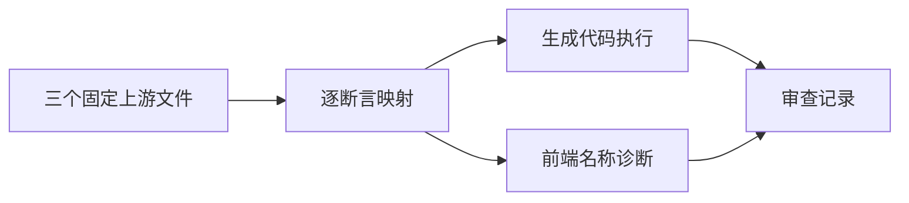
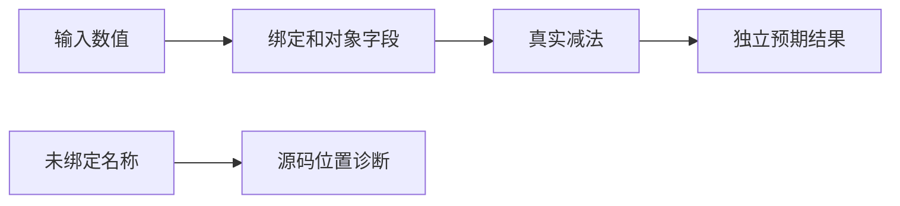

# Test262减法名称读取验证

## IDEA

- Intent：逐项对齐减法GetValue相关三个上游文件，验证真实变量/属性读取及静态名称诊断。
- Data：固定版本7ab7fafa0003f73fc85c1b95d88094d33f7eb8bd下S11.6.2_A2.1_T1/T2/T3原文已读取；当前减法IEEE运行测试不包含这些源码形状。
- Edges：const与静态对象初始化替代var/new Object/赋值；运行期ReferenceError适配为分析期name，不声称动态对象或异常对象等价。
- Answer：五种表达式形状的运行证据、已绑定对照与精确诊断位置、三个哈希核验后的逐文件审查记录。

## 执行计划

1. 生成字面量、左绑定、右绑定、双绑定和属性读取运行案例。
2. 对未绑定左/右及双未绑定检查诊断，添加合法绑定对照。
3. 核验原文哈希，运行专项与目录审计，再登记审查结论。

## 执行结果

新增26个登记案例：21个实际运行、5个前端。五个源码形状对应原T1的五项断言；除字面量外，每形状增加正负、零与精确二进制小数输入。未绑定左、右及双未绑定精确检查标识符span，两个已绑定对照无诊断。独立预期来自Node减法，选值均可精确表示，不把本轮作为舍入或有符号零验证。

三个原文件SHA-256与固定索引逐一一致，审查记录 `upstream/reviews/language/expressions/subtraction_names.jsonl` 新增3条adapted：T1明确静态初始化差异，T2/T3明确运行期ReferenceError与分析期name的差异。没有将后续赋值、动态转换或求值顺序文件一并归类。

在packages/test执行 `zig build test-frontend test-runtime --summary all` 实际退出0，992/992步骤、49,498/49,498测试通过，日志 `/tmp/zxc-subtraction-names.log`。生成一致性、TypeScript、目录审计、格式和diff检查通过，草稿一致。本轮第一次从根目录调用子包脚本路径失败，修正工作目录后生成成功；无生产修改或新缺陷。

最新登记61,408：frontend3,443、runtime46,055、evaluation_order764、safety464、module_graphs10,446、stores236。上游373/53,597已审阅（238 adapted、102 equivalent、33 excluded），53,224未审阅；唯一关联1,910。目录审计日志 `/tmp/zxc-subtraction-names-audit.log`。最新完整根仍阶段115。

## 自我批判

- 静态名称诊断是明确的设计适配，不证明ECMAScript运行时异常兼容。
- 属性值来自静态对象，不覆盖动态原型、访问器或属性赋值。
- 五种源码形状保留原来读取行为，新增输入增强非零断言；它们仍属于少量语义类别，不能用26替代覆盖面判断。
- 原目录其余27个未审阅文件仍保留未审阅状态，包括类型转换、赋值、BigInt和求值顺序，不能因减法普通数值通过而跳过。
