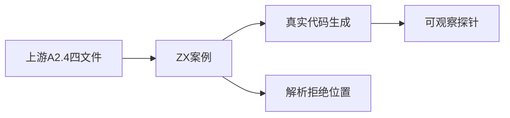
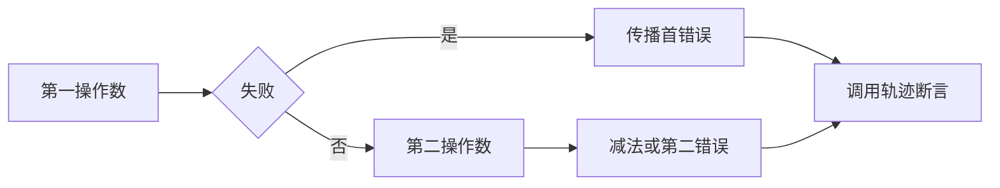

# Test262减法求值顺序验证

## IDEA

- Intent：验证真实生成代码中减法的操作数顺序与首错误传播，审阅上游A2.4四个文件。
- Data：原文逐项读取，现有fallible native探针可记录L/R调用及独立错误身份。
- Edges：函数throw适配为native错误；赋值表达式/隐式全局明确为解析拒绝。ToNumber/ToPrimitive转换顺序不由普通调用轨迹证明，相关文件暂不登记。
- Answer：直接/绑定、正反顺序、四种失败组合，四个赋值语法拒绝位置与逐文件审查。

## 执行计划

1. 生成直接减法和显式绑定两个形状，各自覆盖LR/RL与失败组合。
2. 保留上游四个赋值表达式形状并检查等号处解析诊断。
3. 核验四个上游哈希，运行轨迹/前端专项和审计。

## 执行结果

新增20个登记案例：16个独立调用轨迹（直接/绑定×LR/RL×四种失败组合），4个赋值解析拒绝。探针分别返回2、3或独立LeftFailure/RightFailure，成功减法结果分别-1/1；断言首错误身份、精确L/R轨迹及第二侧是否执行。探针属于已有测试宿主，没有修改生产实现。

原A2.4_T1两项赋值、T3未绑定后赋值、T4隐式全局均保留等号位置并检查syntax；它们是静态设计边界适配，不是原结果的执行等价。A2.4_T2双throw以fallible native适配并链接16条轨迹。四个原文件SHA-256核验通过，逐文件新增4条adapted。已阅读A2.3_T1及order-of-evaluation，但本轮没有验证ToNumber/ToPrimitive机制，保持未审阅登记状态。

`packages/test` 下 `zig build test-frontend test-evaluation-order --summary all` 实际退出0，38/38步骤、4,228/4,228测试通过，日志 `/tmp/zxc-subtraction-order.log`。生成一致性、TypeScript、目录审计、格式、diff、草稿一致性通过。无生产修改或新缺陷。

最新目录61,428：frontend3,447、runtime46,055、evaluation_order780、safety464、module_graphs10,446、stores236。上游377/53,597已审阅（242 adapted、102 equivalent、33 excluded），未审阅53,220，唯一关联1,930。审计日志 `/tmp/zxc-subtraction-order-audit.log`。最新完整根仍阶段115。

## 自我批判

- fallible native模拟可观察失败来源，不提供JavaScript异常对象、throw语法和catch语义。
- 普通函数调用的LR顺序不证明先GetValue再ToPrimitive的四步动态转换顺序；相关上游文件没有因本轮通过被顺带登记。
- 绑定形状是对照；真正运算符求值顺序由直接形状单独覆盖。
- 本轮只使用精确小整数f64值验证轨迹与运算方向，不替代IEEE数值边界测试。
- 赋值语法拒绝虽完成适用性审阅，不增加对上游动态副作用行为的执行覆盖。
