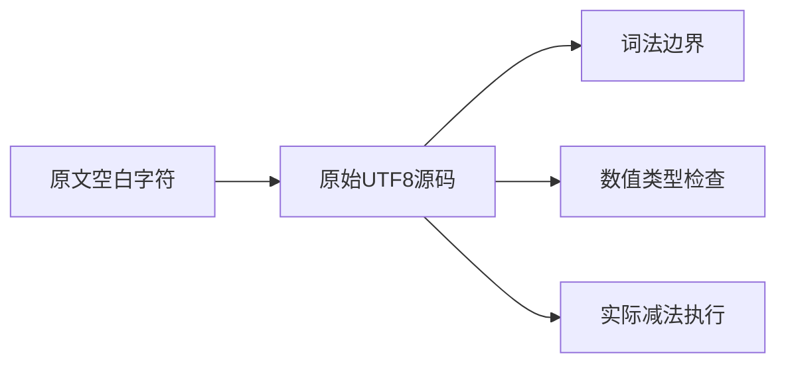
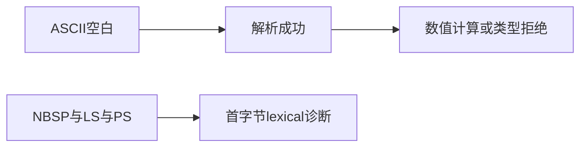

# Test262减法空白边界验证

## IDEA

- Intent：逐项验证上游S11.6.2_A1的九种空白及组合串在减法两侧的行为。
- Data：固定上游原文10个CHECK，已有相等运算空白测试可作为同职责结构参考。
- Edges：ZX接受ASCII空白，NBSP/LS/PS不作为源码空白；编译源码替代eval，不声称提供动态求值。
- Answer：左右/双侧位置、数值/混合类型诊断、接受字符的实际数值执行与精确UTF-8字节跨度。

## 执行计划

1. 生成10种空白×3位置×2类型形状的前端案例。
2. 对6种ASCII空白和3位置执行正/零/负结果。
3. 核验原文哈希、执行专项、保存一条逐项审查记录。

## 执行结果

新增114个登记案例：60前端（10种空白×3位置×数值/混合类型）与54实际运行（6种ASCII×3位置×输入1/0/3）。接受ASCII空白的结果覆盖0/-1/2；前端保留原1减1形式，混合类型true减1必须在分析期拒绝。NBSP、LS、PS及组合串都在首个非ASCII字节报告lexical，跨度按UTF-8字节计算，不把JavaScript字符串索引当字节位置。

S11.6.2_A1原文哈希与固定索引一致，十项字符/组合按原顺序映射。一条adapted记录列出全部诊断与运行断言，明确源码编译替代eval、Unicode空白拒绝差异。

在packages/test执行 `zig build test-frontend test-runtime --summary all` 退出0，996/996步骤、49,688/49,688测试通过，日志 `/tmp/zxc-subtraction-whitespace.log`。生成一致性、TypeScript、目录审计、格式、diff、草稿一致性通过。无生产修改和新缺陷。

最新登记61,614：frontend3,579、runtime46,109、evaluation_order780、safety464、module_graphs10,446、stores236。上游392/53,597已审阅（257 adapted、102 equivalent、33 excluded），未审阅53,205，唯一关联2,116。审计日志 `/tmp/zxc-subtraction-whitespace-audit.log`。完整根基线仍阶段115。

## 自我批判

- 114个具名案例来自同一空白边界族，不应把矩阵数量当作114种独立语义能力。
- 非ASCII拒绝是静态语言差异，不等于上游允许的Unicode空白已经支持。
- 运行输入来自参数，字面量1减1另由前端原形检查；没有实现JavaScript的eval或动态源码执行。
- 有符号零、舍入和极值不属于本轮范围，已有IEEE专项不能被本轮简单值替代。
- 尚未审阅的动态转换和BigInt文件仍保持独立待办，不随A1审阅而自动归类。
