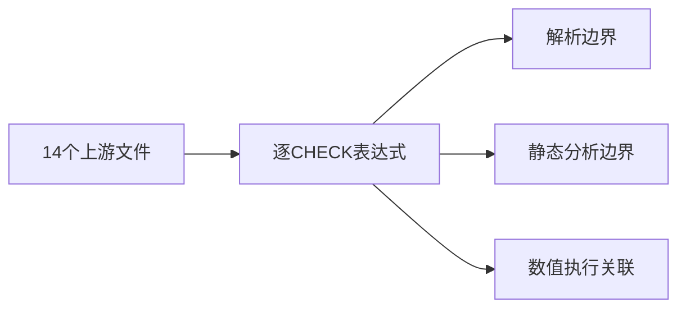
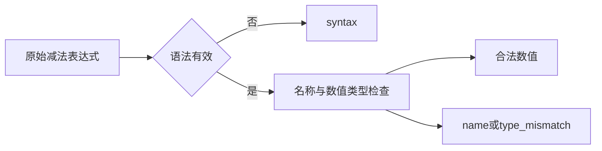

# Test262减法类型转换边界

## IDEA

- Intent：完整审阅A3的14个减法类型转换文件，将每个CHECK原始操作数表达式映射到可定位的本地证据。
- Data：固定上游原文已逐项读取；ZX数值运算静态类型约束与既有数值减法执行证据。
- Edges：bool/string/null不隐式转数值；undefined不是预定义值；new包装对象和function表达式不属于ZX语法。保留原表达式检查边界，不以编译拒绝宣称上游数值或NaN结果兼容。
- Answer：逐CHECK前端案例、原数值断言执行关联、14个逐文件哈希与差异说明。

## 执行计划

1. 转录14个文件的72个CHECK操作数表达式。
2. 区分解析拒绝、名称诊断、类型诊断及数值合法对照。
3. 运行前端与实际数值运行专项，核验哈希后登记审阅。

## 执行结果

14个A3原文的72项CHECK逐项转录，生成72个独立前端案例：42个解析syntax、21个分析type_mismatch、8个分析name、1个合法数值表达式。通过原文CHECK数与每个减法表达式存在性双重核对，14个原文SHA-256均与固定索引相符。每文件都有精确案例/诊断映射，不把包装对象仅替换为原始值。T1.2数值1 - 1额外关联并重跑既有实际执行案例得到0，其余动态转换结果均不宣称等价。

第一次71/72新增案例通过，null - undefined预期name但实际type_mismatch。检查expressions.zig的左侧先分析规则及null可选上下文要求，确认左侧已失败，未进行右侧名称解析；将预期修正为type_mismatch，无生产修改，也未接受任意诊断。

最终在packages/test执行 `zig build test-frontend test-runtime --summary all` 退出0，992/992步骤、49,574/49,574测试通过，日志 `/tmp/zxc-subtraction-conversion-final.log`；首轮日志 `/tmp/zxc-subtraction-conversion.log` 保留。生成一致性、TypeScript、目录审计、格式、diff、草稿一致性通过，无需通知实现会话的新缺陷。

最新登记61,500：frontend3,519、runtime46,055、evaluation_order780、safety464、module_graphs10,446、stores236。上游391/53,597已审阅（256 adapted、102 equivalent、33 excluded），53,206未审阅；唯一关联2,002。审计日志 `/tmp/zxc-subtraction-conversion-audit.log`。本轮新增14条adapted，完整根基线仍阶段115。

## 自我批判

- 这里61,500是当前JSONL登记数，不是阶段110恰好同为61,500的Zig执行汇总，两者不能混用。
- 42个语法拒绝和29个分析拒绝证明原表达式在ZX中的边界，不是上游ToNumber输出的运行兼容。
- 普通对象、函数和包装对象转换协议仍未实现；没有通过替换对象为数字来伪造原断言通过。
- 诊断优先级只在本轮实际表达式上下文中得到证明，不扩大为任意错误组合全局顺序。
- 原数值执行案例复用，不重复增加运行目录计数；新增目录72个均为前端。
