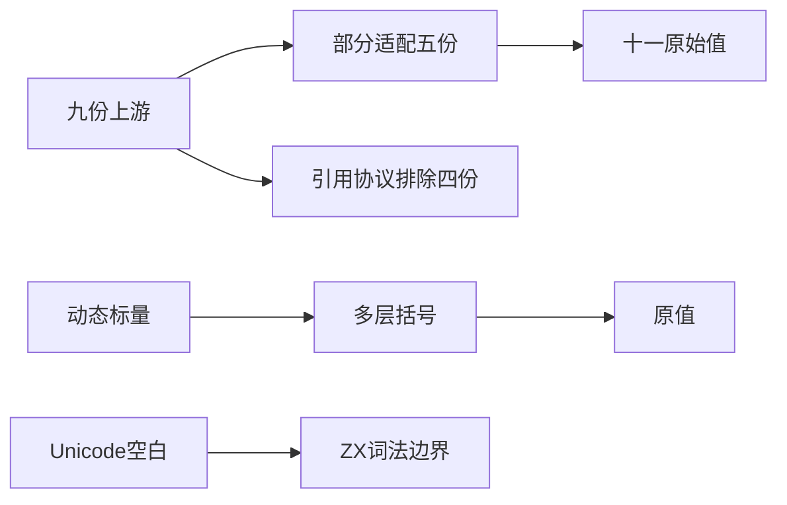
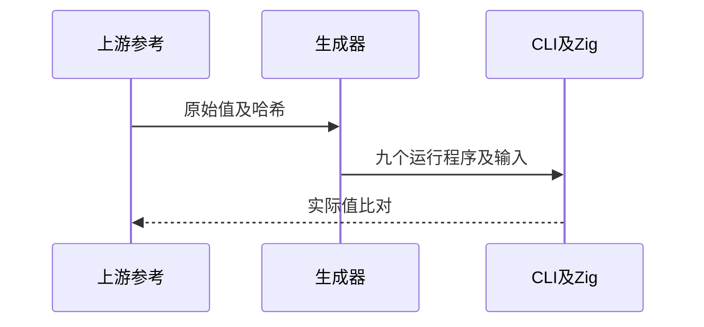

# Test262分组表达式值与空白

## Intent：最终目标

阶段257：对齐grouping目录九份上游的可表达值语义，验证括号不改变运行输入值及词法空白边界。

## Data：可用证据

完整读取九份固定原文；A1的六种ASCII空白可保留静态表达式，三个原始标量文件保留true/1/字符串1与x，undefined文件仅保留null。其余为typeof/delete引用协议。

## Edges：边界与限制

移除eval只保留静态解析值，不声称动态eval支持；对象包装、undefined/void和typeof/delete不适配。null以明确u64?上下文保留缺失值，不扩大为JS空值转换规则。Unicode空白拒绝是ZX差异，不能计上游兼容通过。

## Answer：交付与成功标准

22运行：11原文值+11原生动态多层括号；另4Unicode空白边界精确前端诊断。九原文按flags执行、哈希核验、所有实际ZX表达式独立参考及生成/类型/审计通过。

## 实际结果

test-grouping-values与分组frontend-filter合并运行：49/49步骤、26/26通过。其中22真实运行（11原文值及11动态多层括号），4精确Unicode空白lexical拒绝。已核对正式生成源码与原始输入，动态optional包含none、false、true，避免只验证缺失值。

九份原文SHA核验通过，按noStrict标记排除不允许的严格模式，16次完整原文执行无异常；22实际ZX表达式参考一致；4Unicode空白在JS均合法且值为1，明确保留ZX能力差异。生成器--check、类型检查、目录审计、构建格式及本次注册diff检查通过。

当前64,171案例：运行46,827、前端5,114、轨迹1,084、隔离464、模块10,446、Store236。上游已审阅1,056/53,597（568适配、103等价、385排除），未审阅52,541；关联4,228。grouping九份目录全量审阅为5部分适配、4排除。

## 自我批判

原文eval字符串被变成静态ZX表达式，只验证分组内空白而非eval功能。三个包装对象身份断言没有被静态标量代替；null仅在明确optional类型下保持none值，undefined/void仍未覆盖。四项Unicode拒绝测试没有关联为原文通过断言。

原始分组值与既有运算优先级测试职责不同，本轮没有重复展开算术结合矩阵。没有生产改动、全仓回归或UI验证，无新实现缺陷。
