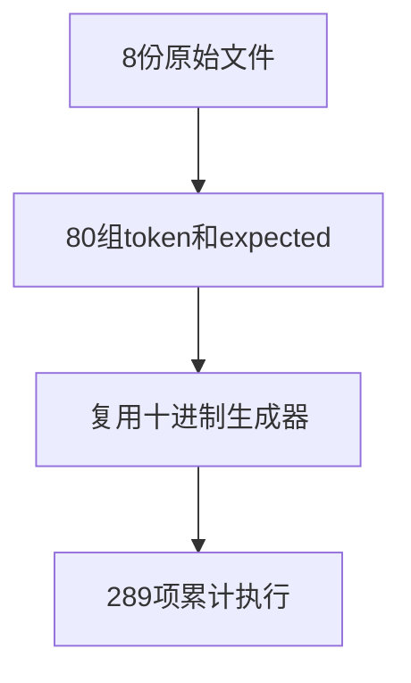
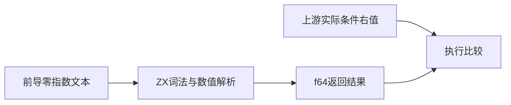

# Test262前导零指数数值验证

## Intent：最终目标

阶段291：验证指数数字带前导零时仍按十进制解释，覆盖大小写指数标记、正负号与零指数。

## Data：可用证据

逐份读取A4.2_T1至T8，实际测试明确允许e01、E01、e-01、E-01、e+01、E+01、e00、E00。每份十条原始条件，共80条。SHA与锁定索引核对。

## Edges：边界与限制

这是指数部分的前导零，不代表旧式八进制字面量。保留每个原始token及条件右值，复用decimal_literals生成器，不新增生产行为或额外排列组合。

## Answer：交付与成功标准

新增80项真实ZX执行与8项adapted，上游原文双模式和提取核验通过，完整十进制专项289项通过，生成与目录审计通过。

## 验证结果

十进制专项13/13步骤、289/289真实ZX执行通过，包含本轮80项。累计29份原文58/58普通/严格模式执行通过，SHA与原始条件逐项核对通过；生成器--check及完整审计通过。本轮未改TypeScript/Zig实现，无需重复类型与格式检查。

目录64,597（运行47,156、前端5,211、轨迹1,084、隔离464、RX模块10,446、Store236）；上游1,299/53,597（607 adapted、103 equivalent、589 excluded），未审阅52,298，关联4,531。

## 自我批判

开始时将相邻A4分组误以为均属于非法指数；实际读取后发现A4.2明确测试合法的前导零，已按原文调整，未按编号猜测语义。八种形式各十条原始检查保持独立追踪，不能推断任意长度指数或极端舍入正确。未发现实现缺陷，未发送实现消息，未跑全仓回归。
