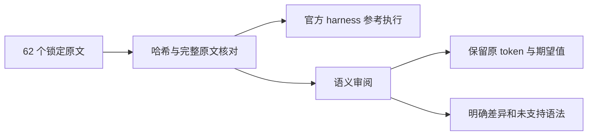
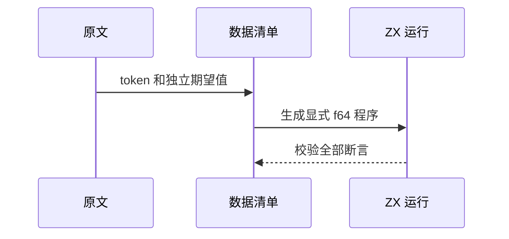

# Test262 剩余数字字面量审阅

## Intent：最终目标

阶段三百一十五：审阅 numeric 目录剩余 62 个原文，在保留源码 token 和原文期望值的前提下适配 ZX 支持的十进制形式。

## Data：可用证据

基于锁定 Test262 提交 7ab7fafa0003f73fc85c1b95d88094d33f7eb8bd，与索引 SHA-256 对照。逐文件读取原文，使用官方 harness 验证原始语义。ZX 词法器仅从数字开始读取十进制数字，小数点后需要数字，支持数字之间的分隔符与指数。

## Edges：边界与限制

旧式八进制及严格模式禁用规则不同于 ZX 前导零始终十进制的契约。二、八、十六进制前缀未支持，其非法例也不能算等价通过。前导点和尾随点指数不补零冒充原文支持。动态 eval 的严格模式用例排除。新增十进制运行值采用显式 f64 契约。

## Answer：交付格式与成功标准

适配数据加入既有 decimal_literals.jsonl，沿用原文字面量运行生成器。其余文件以明确理由逐项登记 excluded。所有原文哈希和参考执行通过；生成器可重复、审阅矩阵有效、ZX 原文十进制专项通过。实际结果：62 个原文哈希及正文核验成功，参考引擎完成 85 次原文执行和 26 次仅解析拒绝；最终适配 6 个文件，新增 114 项 ZX 运行断言，56 个文件明确排除。十进制专项 13/13 构建步骤、403/403 测试通过；生成器重复性与矩阵审计通过。

## 自我复核

原文参考执行数量与 ZX 测试数量分别记录；排除是审阅结论，不计作语言支持。

首次分类错误地把一元正号归入十进制语法，运行于原 token +123456789_0 处拒绝。已核对 parser_expressions.zig 与既有一元正号边界测试，将该文件标为 excluded，未删除正号或改写为另一表达式。首次失败日志保留，未上报为实现缺陷。

合并排除清单时曾覆盖同名文件既有 28 条记录，矩阵总量下降触发复核；已从当前 Git 基线恢复全部 28 条，确认与本阶段 56 条无路径交集后追加。本阶段不修改这 28 条旧审阅结论，后续需单独核对其 adapted 是否充分表达语义差异。

最新矩阵：53,597 个上游文件中已审阅 1,738（625 adapted、103 equivalent、1,010 excluded），未审阅 51,859；关联 4,663 个用例。JSONL 合计 64,760，其中运行 47,283、前端 5,247、求值顺序 1,084、安全 464、模块图 10,446、Store 236。数字目录没有未分类文件，但分类覆盖不等于语义全部支持。

本次未改生产源码、未向实现聊天发消息、未重跑完整根回归。源码生成器本次只补充对指数形式 JSON 数值的判断，避免把 1e+100 误写为非法 1e+100.0。
