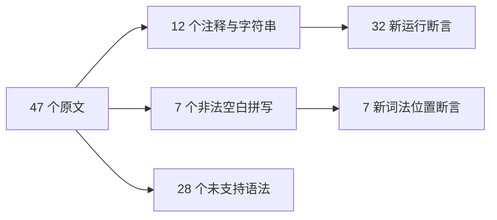
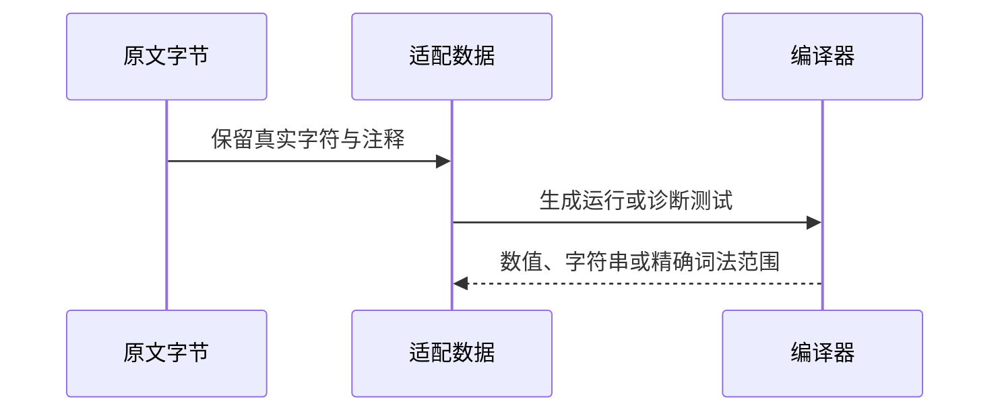

# Test262 剩余空白规则验证

## Intent：最终目标

阶段三百一十九：完成 white-space 目录剩余47个原文审阅，并为可支持的原注释、字符串和非法转义规则增加直接证据。

## Data：可用证据

10个原始注释、5个原始字符串、5个空白 Unicode 转义负例、2个蒙古元音分隔符负例以及25个正则后空白。S7.2_A3.2/A4.2 描述称 VT，实际字节为 FF；A3.3/A4.3 相反。以源字节为准，不按描述重造用例。

## Edges：边界与限制

适配10注释+2字符串+7非法字符；排除3原始控制字符串与25正则后空白。正则整体不支持，不能把其他表达式后空白代替其词法目标。var 改 const、静态包装后保留原字符；eval 负例静态化，不声称动态求值支持。

## Answer：交付格式与成功标准

沿用已建立的两类运行生成器，新增30注释运行、2字符串运行；新增7项精确词法阶段/位置断言。原文核验、生成器重复性、矩阵和相应专项需通过。

## 自我复核

原文描述与字节不一致必须写明；分类完成仅意味着已审阅，不等于支持正则和全部 Unicode 空白。

## 验证结果

运行 `zig build test-comment-characters test-whitespace-positions test-frontend --summary all`：182/182 构建步骤、5374/5374 测试通过（99注释、21位置、5254前端）。本阶段新增39项：32运行与7前端。三个生成器重复性、格式及本次diff检查通过。47原文哈希与正文核验，82次参考执行、12次仅解析拒绝通过。

19 adapted、28 excluded。white-space目录无未分类文件；已分类不代表所有语法支持。矩阵JSONL64887，runtime47403、frontend5254；上游已审阅1816=637 adapted+103 equivalent+1076 excluded，未审阅51781，关联4749。

本阶段没有生产实现变更或确定缺陷，未通知实现聊天。未重跑完整根回归，当前结果只覆盖上述三个专项。
