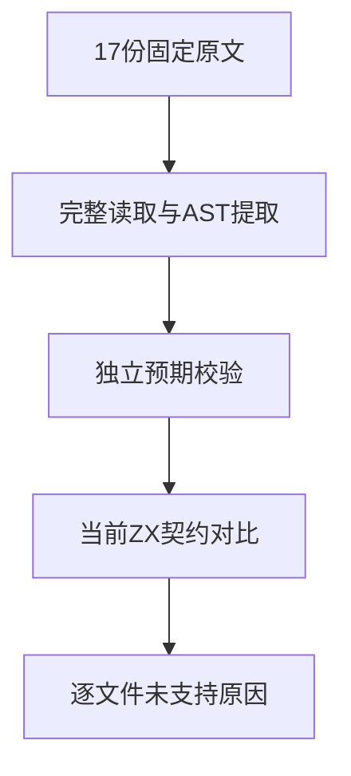

# Test262加法动态协议缺口审阅

## Intent：最终目标

完成加法目录剩余17份原文的逐项语义审阅，明确动态转换和任意精度行为与当前ZX静态契约的差异。不能把不支持语法的拒绝当作原始运行语义通过。

## Data：可用证据

固定版本Test262原文、来源SHA-256、AST断言提取、独立Python整数加法及当前 `packages/zx/IR契约.md`。原文小文件逐项读取，大算术文件全量AST提取及完整结构核对。

## Edges：边界与限制

ZX现有数值契约明确使用固定宽度整数与f32/f64；没有JS的动态对象拆箱、Symbol、任意精度整数或Date/函数默认转换。此轮登记excluded作为未支持能力，不代表完成这些语义。参考JS引擎运行只能验证原文与审阅，不计作zxc测试。

## Answer：交付格式与成功标准

新增17条带具体理由和契约引用的审阅；脚本核对全部来源哈希、算术断言与协议覆盖，目录审计通过。保存结果和自我复核，不增加虚假的ZX通过计数。

## 执行结果

新增17条excluded审阅，每条分别描述原始要求及当前缺口，不新增ZX通过案例。

| 范围 | 原文要求 |
| --- | --- |
| 默认转换4份 | 普通对象8项、Date4项、函数对象4项，以及左侧转换异常先传播 |
| BigInt算术1份 | 306项断言、153个不同操作数对、17个值；Python任意精度整数独立验证所有和 |
| BigInt协议4份 | 混合类型18项异常、Symbol10项异常、包装值8项成功、ToPrimitive20项成功及24项异常 |
| BigInt字符串1份 | 左右位置共10项十进制字符串结果，含超出固定宽度的正负大整数 |
| Symbol转换6份 | 访问器异常、方法调用顺序、this、default提示、对象返回拒绝、数值/字符串分派及Symbol转字符串失败 |
| 完整求值顺序1份 | 六组轨迹为1、12、123、1234、1234、1234，右ToPrimitive必须早于左ToNumeric |

独立核验发现BigInt算术覆盖的是left>=right的三角集合，每对恰好重复两次，反向有序对没有单独覆盖。按原文306项计，6项结果超过u64上限，116项超出i64范围。没有删除n、截断整数或替换成浮点。

`加法动态协议审阅/原文校验.py`核对17个来源哈希、完整AST/文本断言数、全部整数结果、三角集合与重复次数、转换断言数、六组轨迹及10个十进制字符串，日志 `/tmp/zxc-addition-protocol-review.log`。

`加法动态协议审阅/参考引擎校验.mjs`使用同一固定版本的原始sta.js和assert.js，在隔离VM中执行17份原文各自的严格/非严格模式，共34次均通过，日志 `/tmp/zxc-addition-protocol-reference.log`。这是Node v25.8.1的参考证据，不是ZX执行，也不计入测试包通过数量。

目录审计通过，日志 `/tmp/zxc-addition-protocol-audit.log`：上游审阅533/53,597（345 adapted、103 equivalent、85 excluded），未审阅53,064，唯一关联2,980。加法目录48份已逐项登记：23 adapted、8 equivalent、17 excluded。登记目录仍62,474。

本轮只有审阅与证据文件变化，没有生产源码或测试逻辑修改，不重复执行无关编译。diff与审阅草稿逐字节一致性通过，最新完整根仍阶段170。

## 自我批判

BigInt算术原文有306条断言，但只有153个不同操作数对，每对重复两次；不把它写成306个独立案例或完整17×17有序矩阵。审阅完整不等于动态语义兼容，excluded依然是目标中的未完成能力。

原文中某些旧版info使用ToNumber描述，现代加法先执行双方ToPrimitive，再决定字符串或数值分派；本轮按实际断言及当前步骤区分，尤其不把第五组轨迹误写为余数测试中的123。完成该目录审阅不消除上述未支持语义。
