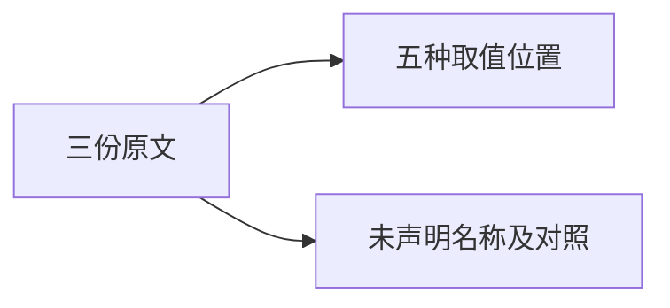
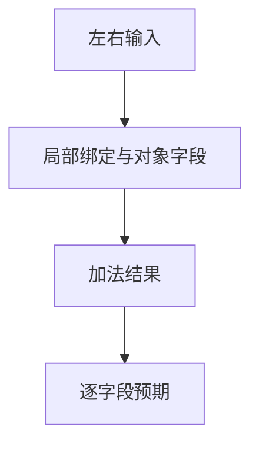

# Test262加法取值位置验证

## IDEA

- Intent：补齐加法A2.1三份原文的取值位置与名称诊断。
- Data：五个1+1=2原断言、两侧未声明ReferenceError原文、既有余数名称生成器布局。
- Edges：静态对象与分析期名称诊断属于适配；不证明动态对象和运行期异常兼容。
- Answer：8个案例、3条来源审阅、原文校验与真实生成代码运行。

## 结果

新增8个案例：4个运行输入分别为(1,1)、(5,3)、(-5,3)、(5,-3)，每项输出五个取值位置；4个前端案例为左右名称未声明/已声明。新增3条adapted来源审阅。

`zig build test-frontend test-runtime --summary all`退出0，1,033/1,033步骤、50,285/50,285测试通过，日志 `/tmp/zxc-addition-names.log`。原文三份哈希、五个原断言、四组独立手算结果和名称跨度校验通过，日志 `/tmp/zxc-addition-names-review.log`。

目录审计62,259：前端3,999、普通运行46,286、轨迹828、安全464、模块10,446、Store236。上游497/53,597（326 adapted、103 equivalent、68 excluded），未审阅53,100，唯一关联2,765。审计和TS日志 `/tmp/zxc-addition-names-audit.log`、`/tmp/zxc-addition-names-typecheck.log`。

生成器已接入根--check，类型检查、生成一致性、格式、diff及五份草稿检查通过。没有生产修改或新缺陷。最新完整根执行仍阶段145，专项通过不覆盖其legacy失败。

## 自我批判

数值输入固定为f64，未覆盖JS加法的字符串拼接和动态ToPrimitive分派；静态对象字段与名称诊断阶段差异在来源记录中明确为适配。左右不同值避免五种取值位置都只验证同一个常量，但不能取代动态引用身份语义。没有把五个输出字段重复计作五个目录案例。
