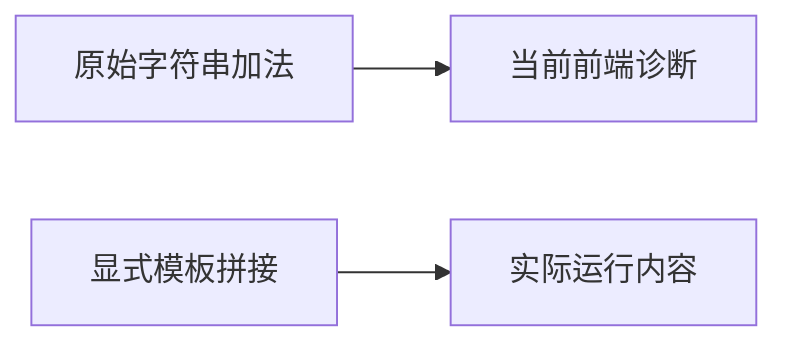
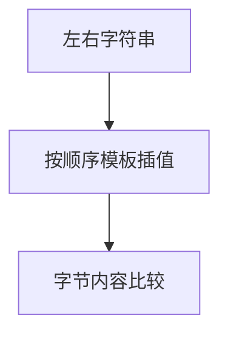

# Test262加法字符串边界验证

## IDEA

- Intent：逐项记录加法字符串六份原文与当前ZX边界，验证显式模板拼接的独立结果。
- Data：36个原始表达式、实际分析器仅数值加法限制、已有模板字符串实现。
- Edges：模板拼接不是+重载；动态包装与隐式转换尚未实现。
- Answer：36前端边界与9个显式模板运行案例、6份适配审阅、原文校验和专项结果。

## 结果

新增45个案例（36前端原式边界、9显式模板运行），新增6条adapted审阅。六份原文各6/4/10/8/4/4项表达式均保留；三个原始字符串结果11/x1/1x通过显式模板重表达，另外检查空串、中文、非BMP字符和组合字符不归一化。模板案例没有替换前端原加法表达式。

`zig build test-frontend test-runtime --summary all`退出0，1,041/1,041步骤、50,448/50,448测试通过，日志 `/tmp/zxc-addition-strings.log`。独立原文脚本核验6个哈希、36个表达式及9个手写预期，日志 `/tmp/zxc-addition-strings-review.log`。审计、TS、根生成器--check接入、生成一致性、格式、diff与5份草稿通过。

目录62,438：前端4,099、普通运行46,349、轨迹844、安全464、模块10,446、Store236。上游508/53,597（337 adapted、103 equivalent、68 excluded），未审阅53,089，唯一关联2,944。日志 `/tmp/zxc-addition-strings-audit.log`、`/tmp/zxc-addition-strings-typecheck.log`。没有生产修改或新回归缺陷；最新完整根仍阶段145。

## 自我批判

36个拒绝案例证明当前静态边界，不证明JS字符串加法已实现；9个模板案例证明显式字符串组合，不是+的等价执行。动态包装、隐式ToString、函数与对象转字符串仍缺失。本轮不应被计作45项原JS成功断言。新增运行样值只是内容检查，所有权、分配失败和极长字符串由其他专项负责，不能由这里推断。
