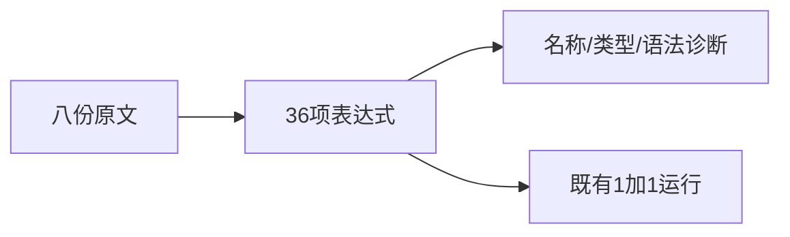
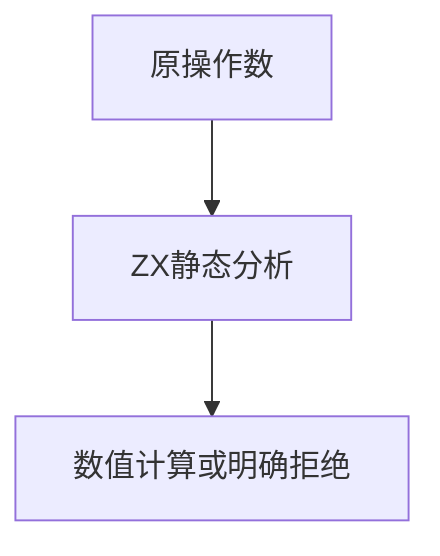

# Test262加法数值转换边界验证

## IDEA

- Intent：逐项核验A3.1八份原文的36项非字符串加法转换要求。
- Data：原文布尔/数值包装、null、undefined组合，现有1+1运行案例及静态数值契约。
- Edges：除1+1外的静态拒绝不证明原ToNumber语义通过；不把NaN断言改写成0。
- Answer：36项前端案例、8条审阅、独立来源校验与执行证据。

## 结果

新增36个前端案例与8条adapted来源审阅，所有原始操作数保留，11项isNaN断言只抽取其加法表达式，不把预期NaN改写为其他数值。原始1+1=2关联已有运行案例，并复跑普通运行目录，没有重复登记。

`zig build test-frontend test-runtime --summary all`退出0，1,041/1,041步骤、50,484/50,484测试通过，日志 `/tmp/zxc-addition-conversion.log`。独立校验8个原文哈希、36项表达式与CHECK数量、11项NaN表达式及既有数值结果，日志 `/tmp/zxc-addition-conversion-review.log`。TS、生成一致性、根生成器--check接入、格式、diff和3份草稿检查通过。

目录62,474：前端4,135、普通运行46,349、轨迹844、安全464、模块10,446、Store236。上游516/53,597（345 adapted、103 equivalent、68 excluded），未审阅53,081，唯一关联2,980。审计/TS日志 `/tmp/zxc-addition-conversion-audit.log`、`/tmp/zxc-addition-conversion-typecheck.log`。没有生产修改或新增实现缺陷；最新完整根仍阶段160。

## 自我批判

本轮主要证明ZX当前类型/名称/解析拒绝边界，而不是补全ToNumber。包装对象、bool/null数值转换与undefined NaN语义仍缺失；adapted不能计为原JS通过。已有数值运行关联只覆盖1+1，不代表其余35项的动态结果已执行。
