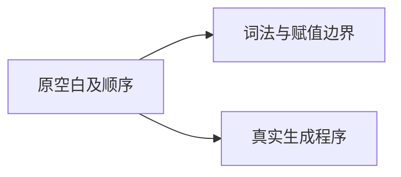
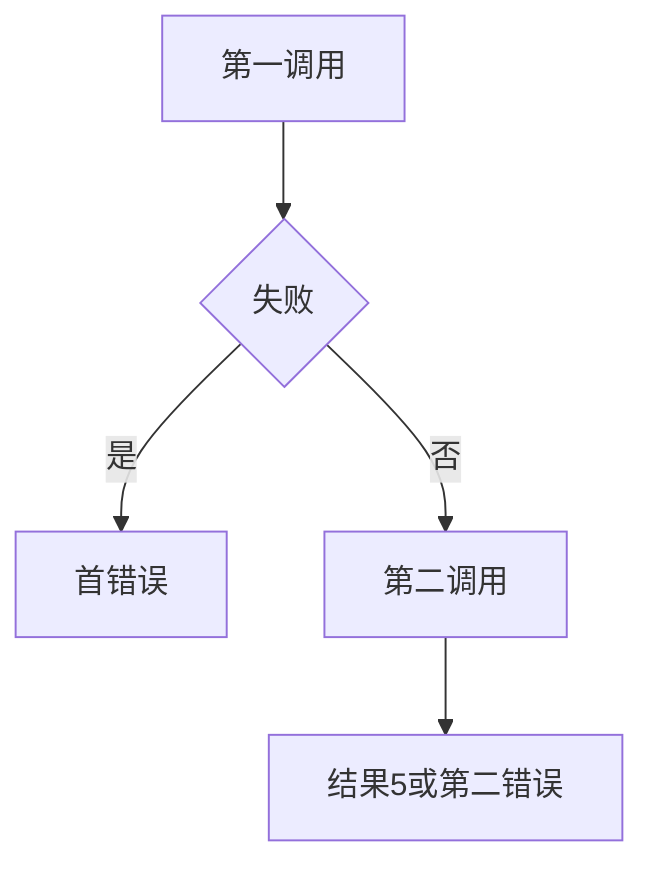

# Test262加法空白与顺序验证

## IDEA

- Intent：对齐A1十项空白原断言与A2.4四份顺序原文。
- Data：原1+1=2、x初始0的两项赋值、双throw调用及现有独立调用探针。
- Edges：非ASCII空白拒绝、赋值解析拒绝记录为适配，不能证明原JS动态语义通过。
- Answer：134个案例、5条来源、原文独立核验与前端/运行/轨迹专项。

## 结果

新增134个案例（64前端、54普通运行、16轨迹），关联5份原文并记录adapted。A1十项空白逐项保留，ASCII运行输入1得到2，Unicode空白保留词法拒绝。A2.4赋值原文初值均0；顺序探针独立比较LR/RL和首错误，避免成功值同为5掩盖顺序错误。

`zig build test-frontend test-runtime test-evaluation-order --summary all`退出0，1,086/1,086步骤、51,248/51,248测试通过，日志 `/tmp/zxc-addition-boundary.log`。

独立脚本检查5个哈希、10项原空白表达式、54个数值结果、4个等号跨度及16个事件序列，日志 `/tmp/zxc-addition-boundary-review.log`。审计与TS日志 `/tmp/zxc-addition-boundary-audit.log`、`/tmp/zxc-addition-boundary-typecheck.log`。生成器已同步接入根--check；生成一致性、格式、diff和9份草稿通过，无生产修改或新缺陷。

目录62,393：前端4,063、普通运行46,340、轨迹844、安全464、模块10,446、Store236。上游502/53,597（331 adapted、103 equivalent、68 excluded），未审阅53,095，唯一关联2,899。最新完整根执行仍阶段145。

## 自我批判

赋值语法拒绝不能证明原赋值运行结果；Unicode空白拒绝也不是原JS兼容。函数调用轨迹验证直接操作数执行顺序，不包含动态ToPrimitive/ToNumeric。整数样值的加法不能代替浮点舍入、溢出或字符串拼接，其他语义需独立覆盖。
