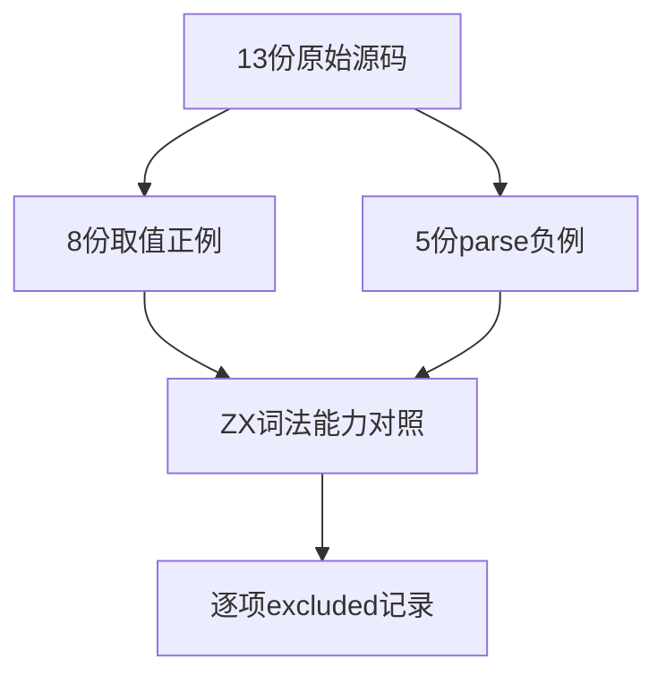
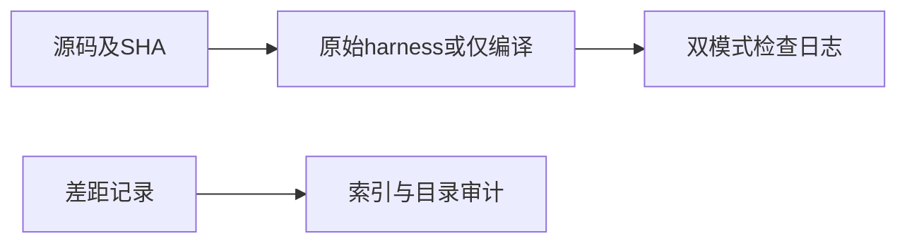

# Test262十六进制与数字邻接审阅

## Intent：最终目标

阶段292：逐文件辨明十六进制取值、非法十六进制及数字后标识符邻接限制，避免把不支持语法的普遍拒绝误记为规范负例等价。

## Data：可用证据

已读A5.1_T1至T8、A6.1/A6.2各两份及numeric-followed-by-ident，共13份；ZX lex.zig只按十进制数字扫描，公开Operator没有in。现有numeric_boundaries覆盖部分基数前缀拒绝，不能证明支持该基数。

## Edges：边界与限制

13项全部excluded，无新增虚假适配；原始脚本核验不计为ZX执行。负例只编译，绝不运行$DONOTEVALUATE。

## Answer：交付与成功标准

13条逐项差距记录及SHA核验；八项正例双模式执行，五项负例双模式仅编译，共26次检查；目录审计通过。

## 逐项原文

| 文件 | 实际断言 |
| --- | --- |
| S7.8.3_A5.1_T1 | 0x前缀与0至F十六种单数字的值 |
| S7.8.3_A5.1_T2 | 0X前缀与0至F十六种单数字的值 |
| S7.8.3_A5.1_T3 | 0x前缀的多位十六进制，包含16至268435456 |
| S7.8.3_A5.1_T4 | 0X前缀的多位十六进制，包含16至268435456 |
| S7.8.3_A5.1_T5 | 0x前缀且数字部分含前导零的多位值 |
| S7.8.3_A5.1_T6 | 0X前缀且数字部分含前导零的多位值 |
| S7.8.3_A5.1_T7 | 0x前缀与小写a至f的六个值 |
| S7.8.3_A5.1_T8 | 0X前缀与小写a至f的六个值 |
| S7.8.3_A6.1_T1 | 0x缺少十六进制数字的parse SyntaxError |
| S7.8.3_A6.1_T2 | 0X缺少十六进制数字的parse SyntaxError |
| S7.8.3_A6.2_T1 | 0xG含非法大写十六进制数字的parse SyntaxError |
| S7.8.3_A6.2_T2 | 0xg含非法小写十六进制数字的parse SyntaxError |
| numeric-followed-by-ident | 3in []违反NumericLiteral与IdentifierStart直接邻接限制的parse SyntaxError |

## 验证结果

13份SHA均匹配索引。原文双模式26/26检查通过：16次执行正例，10次仅编译验证SyntaxError；原始负例未执行。完整目录审计通过，上游累计1,312/53,597（607 adapted、103 equivalent、602 excluded），未审阅52,285；目录64,597与关联4,531不变。

## 自我批判

本轮完成差距登记，没有实现十六进制或in，也没有新增ZX执行覆盖。部分原文错误消息的文字仅用于报错，本轮依据实际条件、元数据和执行结果判断。未以修改输入为十进制来伪装十六进制适配。没有发现既有实现违约，未发送实现消息；未跑Zig或全仓回归。
