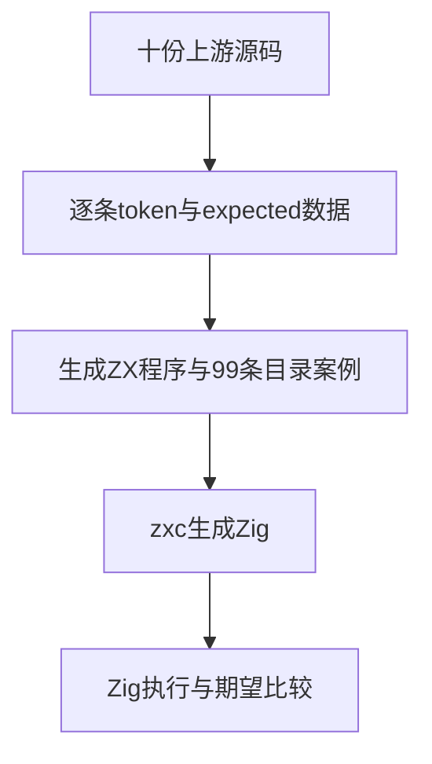
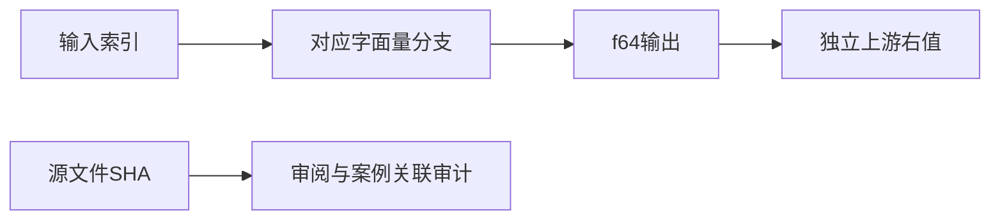

# Test262十进制与指数数值验证

## Intent：最终目标

阶段288：将十份上游十进制及指数形式数值断言转成真实ZX执行案例，验证词法、数值解析、类型上下文与代码生成。

## Data：可用证据

逐份阅读S7.8.3_A1.1_T1/T2及A1.2_T1至T8，提取实际if条件的字面量与右侧预期，不依赖错误消息。A1.2_T2中1E1的错误消息误写为1，但实际条件预期10，按实际断言记录。

## Edges：边界与限制

使用f64返回契约对应本批有限且可表示的Number值，输入索引选择各原始字面量；不宣称ZX全部数值语义与Number等价。99项分别覆盖源文本形式，不按源文件数量替代执行案例数量。本轮没有扩展运算符。

## Answer：交付与成功标准

10条adapted审阅关联99条执行案例及预期字段；可重建生成器与数据、独立专项目标、原文SHA与断言核验、类型/目录审计通过。

## 验证结果

`zig build test-decimal-original --summary all`退出0，13/13步骤、99/99真实ZX生成程序测试通过。标准control runner使用expectEqualDeep核对实际f64结果。10份上游原文普通/严格模式共20/20执行通过，提取的99对token/expected与原文条件逐项匹配，SHA匹配。

生成器--check、TypeScript类型检查、完整目录审计、Zig格式及本次diff空白检查全部通过。目录现64,391条（运行46,966、前端5,195、轨迹1,084、隔离464、RX模块10,446、Store236）；上游累计1,266/53,597（588 adapted、103 equivalent、575 excluded），剩余52,331，关联4,341。

## 自我批判

原文部分比较是同一token的自比较，ZX适配将token置入f64上下文，并与独立目录预期比较，避免同一解析错误在两侧相互抵消。该适配没有覆盖默认类型推导、超范围数字或动态Number对象行为，不以99个有限样本证明所有十进制解析正确。没有发现实现缺陷，未给实现会话发送消息；未运行完整仓库回归。
