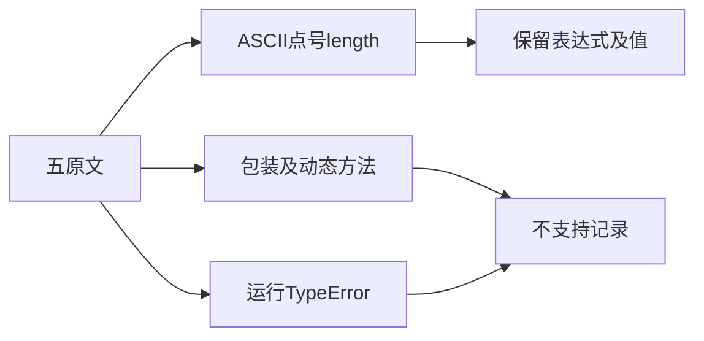
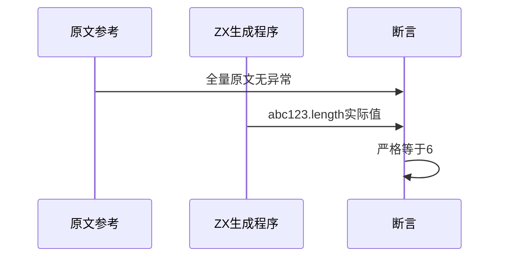

# Test262原始值属性访问审阅

## Intent：最终目标

阶段259：逐项审阅原始值属性访问五份用例，明确静态字符串长度与JS ToObject、动态属性及运行异常的边界。

## Data：可用证据

完整读取S11.2.1_A3_T1至T5。仅T3第三项"abc123".length===6可保留原表达式和预期；其余涉及包装、toString/toFixed/charAt、字符串键索引、undefined/null属性访问TypeError。

## Edges：边界与限制

不通过预先格式化字符串、模板插值或静态类型拒绝替换原协议。长度只对本ASCII文本保持相同，不推断UTF-16与UTF-8一般等价。已有动态长度用例不重复生成。

## Answer：交付与成功标准

新增一项完整原始表达式真实编译运行；五原文完整双模式参考及哈希通过，登记一份部分适配四份排除；生成/类型/审计通过。

## 实际结果

新增原始"abc123".length表达式运行测试，13/13步骤、1/1通过，实际值6。五份原文SHA及完整strict/sloppy共10次执行通过，包括原文内部的TypeError检查；ZX仅关联T3第三项，其他断言不计覆盖。生成器--check、TypeScript类型、目录审计、构建格式及本次注册diff检查通过。

当前64,188案例：运行46,828、前端5,130、轨迹1,084、隔离464、模块10,446、Store236。已审阅1,065/53,597（573适配、103等价、389排除），未审阅52,532，关联4,237。property-accessors目前仅完成这5/21份，未宣称整目录完成。

## 自我批判

只新增一项是因为其余原文语义无法忠实转换，不能为增加测试数把toString改写成模板、charAt改成字节索引，或把TypeError变成静态类型错误。这个ASCII值不能证明非ASCII的UTF-16长度等价；既有本地字符串长度覆盖不在本次重新计数。

没有生产改动、全仓回归或UI验证，无新实现缺陷。已读到但未完整分析的A4系列未登记审阅，保留给后续逐项处理。
