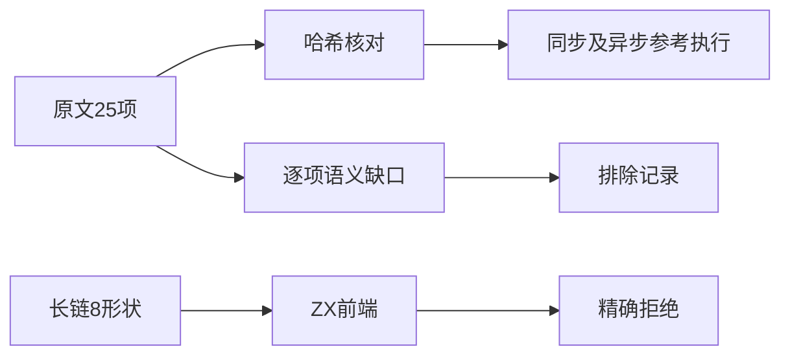
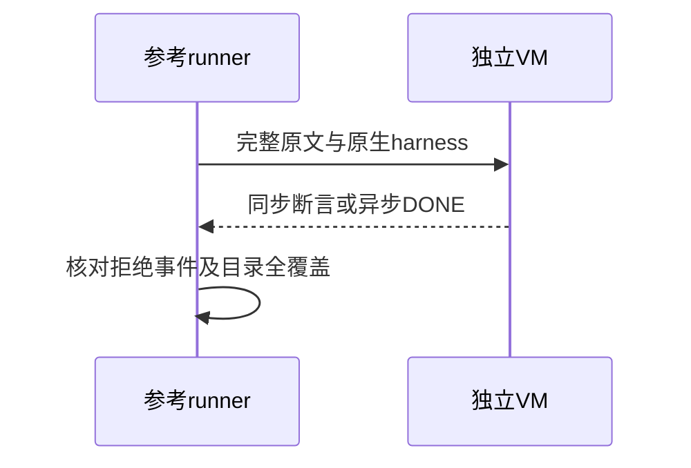

# Test262可选链目录审阅收口

## Intent：最终目标

阶段266：完成可选链剩余25文件的逐项语义审阅，建立同步、异步与parse负例完整参考证据。

## Data：可用证据

全部原文已完整读取，涉及动态this、eval、super/new.target、循环、Promise/await及长链传播；25项分别写明缺口。沿用上一轮真实前端确认的不支持可选链证据。

## Edges：边界与限制

不会把普通点号读取替代可选链，不会把静态拒绝替代运行异常。异步原文必须等待$DONE并检查超时；其中identifier测试故意生成未消费的Promise.reject(undefined)，须独立记录，不能一律忽略未处理拒绝。

## Answer：交付与成功标准

25个SHA及strict/sloppy完整执行；异步完成有断言，parse负例只编译不执行。目录38项路径全覆盖且无重复；8个长链形状原生parse边界精确定位。生成/类型/审计通过。

## 实际结果

25个SHA校验通过，38文件路径完整且不重复。完整原文严格/非严格两模式共50次验证：36同步执行、12异步$DONE、2parse负例。每个异步用例$DONE恰好一次，3秒超时保护。member-expression-async-identifier原文故意创建的拒绝Promise在两模式各触发一次undefined拒绝，其余用例均无未处理拒绝；完整事件数组核对通过。

8个长链读取、括号、递归、调用结果、普通链后可选链形状，在JS语法有效，在ZX准确指向第一个可选链点号；5/5构建步骤8/8案例通过。生成--check、类型、目录审计、Zig格式检查通过。目录64,264（前端5,181，运行46,853）；上游1,132（575适配、103等价、454排除），未审阅52,465。

## 自我批判

审阅完成不代表可选链实现；38项排除均需随语言决策重新评估。缺口根因是整个可选链协议缺失，继续复制大量相同点号拒绝案例不会增加运行语义覆盖，因此只补8个不同结构。异步参考没有改写Promise或屏蔽全部拒绝，而是校验原文确切事件。当前证据不证明ZX的Promise、this或循环能力，也不宣称全仓回归。本轮没有正式生产源码修改。
