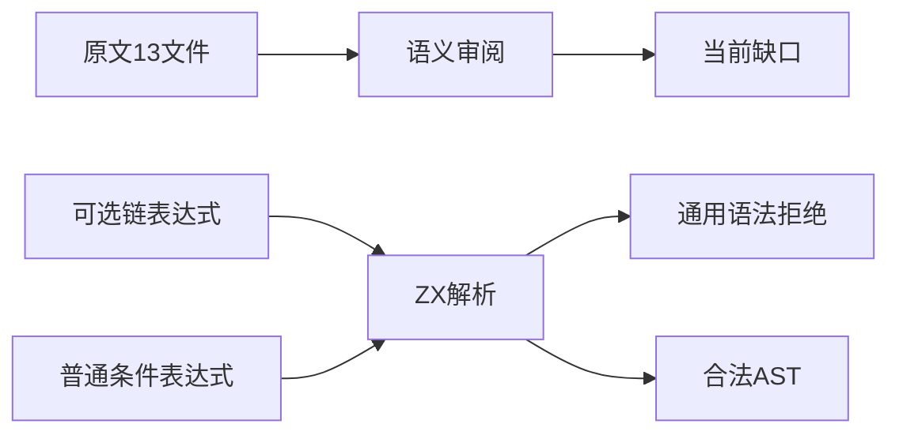
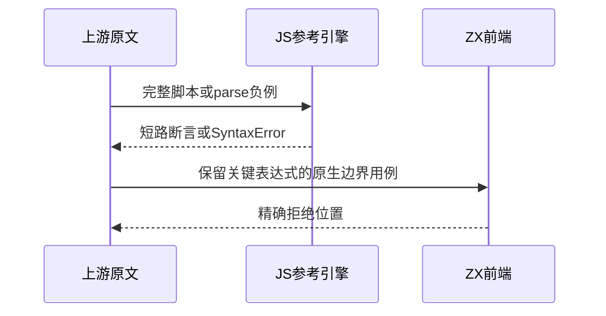

# Test262可选链语法与短路边界

## Intent：最终目标

阶段265：审阅可选链短路、十进制前瞻与写入/模板限制，避免未实现基础语法造成的假阳性。

## Data：可用证据

完整读取13上游文件：短路1、十进制前瞻1、写入限制3、模板尾部8。ZX lexer只从数字开始扫描number，parser的问号用于条件表达式，没有可选链AST。

## Edges：边界与限制

13原文均记录当前差异。合法可选链也被拒绝，因此非法链被拒绝不能证明对齐。true ?.30 : false不可改为0.30后计通过。原生测试明确是语法边界，不验证运行短路或类型转换。

## Answer：交付与成功标准

原文哈希核对和双模式参考验证；测试精确parse/syntax范围，以及普通条件表达式对照。生成一致性、类型检查及目录审计通过，保留执行证据。

## 实际结果

19/19案例、5/5构建步骤通过：15项在问号后点号位置报parse/syntax，4项普通条件/合并表达式解析通过。13个上游文件SHA核验通过；两个正例各在strict/sloppy完整执行，11个负例各在两模式解析拒绝，共26次。19个ZX关键表达式以JS解析独立分类，合法可选链及十进制前瞻确实在JS中合法。

生成器--check、TypeScript检查、目录审计、Zig格式和本次注册diff检查通过。目录64,256项，其中前端5,173、运行46,853，其余不变；上游1,107项，575适配、103等价、429排除，未审阅52,490。可选链目录13/38已审阅。已将可选链及前导点小数缺口发送实现会话，生产源码没有改动。

## 自我批判

不能把数量增加解释成可选链兼容性提升；本轮交付是经参考验证的缺口清单和可重跑的当前边界。未来支持可选链后，合法读取与调用的拒绝预期必须更新为运行断言，并重新审阅这些excluded记录。四个正向对照只证明parse，部分故意保留JS异构分支和未匹配ZX类型，不声称analyze或执行通过。没有全仓回归及UI验证。
