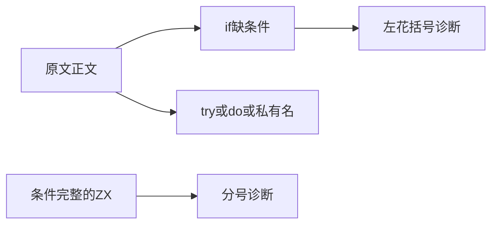
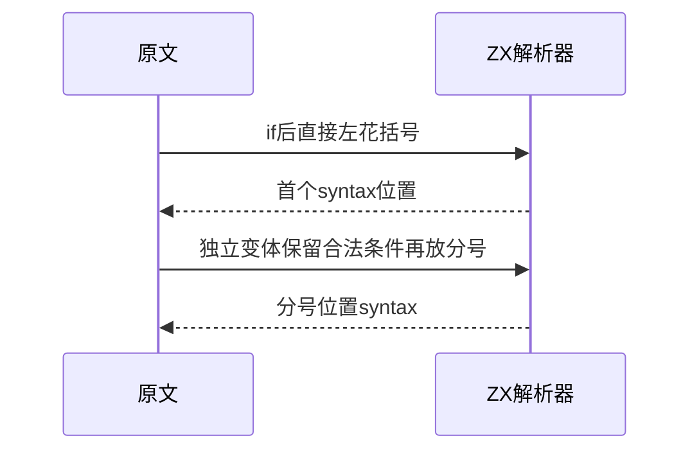

# Test262块语法边界

## Intent：最终目标

核对块语法负例真实失败原因，区分缺if条件、无分号限制、try/do结构和私有名称规则。

## Data：可用证据

完整读取12.1-1至7和四份early-errors私有名称负例。12.1-4/5/6虽描述分号，正文从if{}开始，首先缺少条件括号；不以描述替代正文。ZX支持if/else，但不支持原文try/do和类私有名称体系。

## Edges：边界与限制

保留三份if原文首个错误及后续结构，诊断首个左花括号；另外独立构造条件完整的分号分隔负例，检查分号位置。不在不支持的try或私有字段语法入口提前失败就声称对齐。

## Answer：交付与成功标准

三项原文结构适配和两项ZX无分号边界，五个精确parse syntax断言；11份原文SHA和strict/sloppy解析检查；三适配八排除逐项登记。

## 实际结果

新增五项前端parse syntax精确诊断，5/5步骤5/5通过；前三项定位if之后首个{，后两项定位完整条件分支后的分号。没有将return路径分析或空行格式提前失败当作目标错误。

11份完整原文与固定索引SHA一致，按无onlyStrict/noStrict限制运行strict/sloppy共22次预期SyntaxError解析检查通过。三个适配保留完整原文if结构，五个实际ZX函数体的JS参考解析均失败，位置字符独立核对。生成器--check、类型、构建格式及本轮新增文件空白检查通过，四份正式文件与草稿副本逐字一致。

目录审计通过：63,915案例（前端5,040、运行46,661），上游980/53,597：539适配、103等价、338排除，剩52,617；关联本地4,166。不表示63,915项本轮全部运行，本轮实际ZX执行范围只有五项前端。

## 自我复核

原文标题不能决定真正验证范围：12.1-4/5/6未进入分号便因if缺条件失败。本轮将其标作缺条件适配，分号位置另建独立用例。try/do/私有名称八份记录excluded，没有借用不支持语法的入口拒绝冒充语义检查。

保留负例中的分号是测试无效源码的必要部分，不是漏迁移。未修改生产源码、放宽诊断或运行浏览器；Context专项保持已删除。
