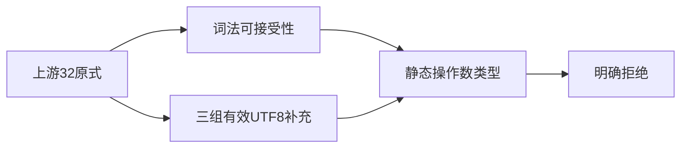
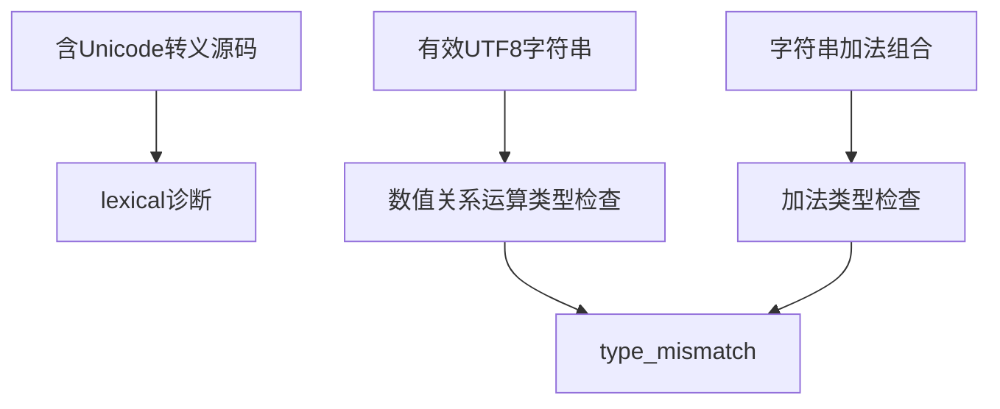

# Test262 字符串关系边界

## Intent：最终目标

逐条明确字符串关系比较在 ZX 的边界，不把字符串字节相等或数值关系运算误认为已经支持 JavaScript 字符串顺序。

## Data：可用证据

已读取 less-than 的 A4.10、A4.11、A4.12_T1、A4.12_T2，共 32 条原表达式。analysis/expressions.zig 对非数值只允许指定相等运算；generate_operator_types.ts 已覆盖 string 类型关系拒绝，但没有覆盖这些具体源表达式。

## Edges：边界与限制

ZX 字符串关系比较不提供，源 Unicode 转义也需与原生 UTF-8 字符区分。含字符串加法的原式可能先在加法处拒绝，不能当作比较阶段拒绝的证据。代理项与 UTF-16 码元排序不属于当前 UTF-8 字节字符串契约。

## Answer：交付与成功标准

32 个原表达式分别验证词法或类型错误，再加入三条有效 UTF-8 BMP/补充平面操作数验证词法成功后的类型拒绝。每个原文件逐项核验哈希并记录适配差异，不断言原字符串排序结果已实现。

## 执行结果与自我批判

新增 35 个前端案例：32 条原式和 3 条有效 UTF-8 比较。其中 9 条词法拒绝，26 条类型拒绝。前端专项 **5/5 步骤、3,173/3,173 测试通过**，日志 `/tmp/zxc-relational-strings.log`。TypeScript、生成一致性、目录审计、格式与 diff 检查通过；无生产修改或新实现缺陷。

四文件源码与哈希核验完成，新增 4 adapted，每条原式均映射具体诊断。累计登记 57,631：runtime 42,548、frontend 3,173、evaluation_order 764、safety 464、module_graphs 10,446、stores 236。上游 316/53,597（181 adapted、102 equivalent、33 excluded），剩余 53,281，关联案例 1,345。最近完整根仍为阶段 83。

自我批判：本轮验证的是当前选定静态语言契约的拒绝行为，没有为 ZX 增加字符串字典排序能力，也不能视为原 ECMAScript 布尔结果通过。加法组合的诊断不能定位到关系运算，文档与审阅理由已单独说明；三条原生 UTF-8 案例则排除了词法失败对类型边界的遮蔽。
