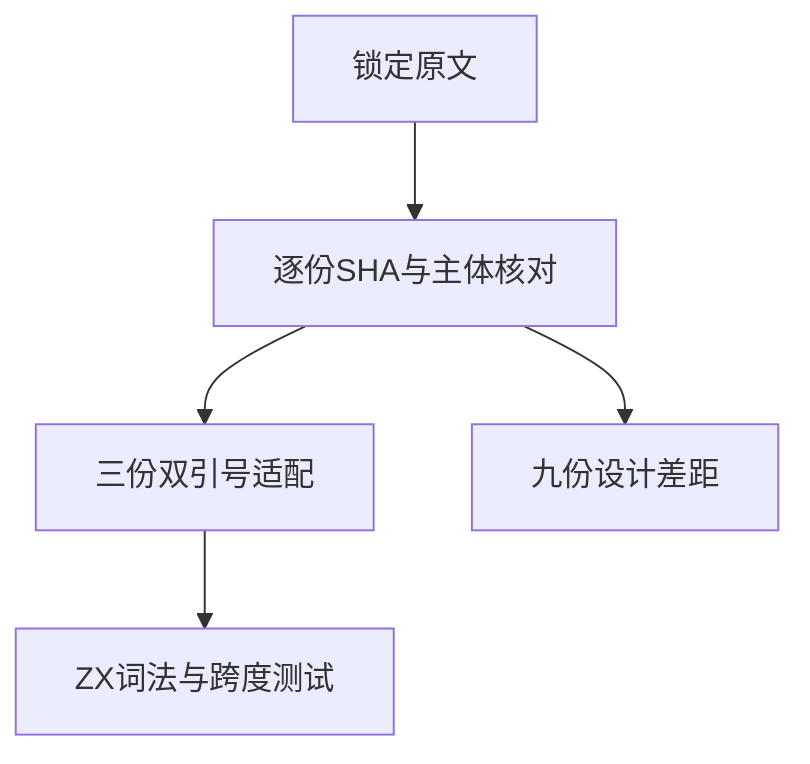

# Test262字符串定界与转义边界验证

## Intent：最终目标

逐份核对十二个尚未审阅的字符串原文，区分ZX能承接的未闭合双引号行为与单引号/Unicode转义差距，补齐真实前端负例。

## Data：可用证据

锁定Test262快照的S7.8.4_A1至A3相关十二份原文、SHA-256，以及当前zx/frontend/lex.zig。三份双引号parse负例保留原始定界符和反斜杠序列；五份字符表测试核心为Unicode转义解码，四份单引号负例核心为JS字符串定界。

## Edges：边界与限制

不执行parse负例，原文只用解析器验证拒绝；五份正例执行官方harness普通和strict两种模式。ZX不支持Unicode转义和单引号，九份明确excluded，不能改写成直接字符或双引号冒充支持。

## Answer：交付与成功标准

新增三项前端lexical断言，分别校验三引号中最后一个定界符、转义引号未结束、三反斜杠后引号未结束。完整前端、生成一致性、类型与目录/上游审计通过后登记计数。草稿与原文证据保存在同日目录。

## 自我复核

三引号的错误起点是最后一个引号，不能沿用其他未闭合字符串的第一个引号。原文harness成功不算ZX运行通过；excluded不算已实现支持。对字符表只比较最终字符会掩盖缺失转义语法，因此保持排除。

## 阶段298实际结果

完整前端退出0，5/5步骤、5,214/5,214测试通过，净增三项精确词法断言。十二份原文SHA/主体核对通过；七份parse负例共14次解析拒绝，五份正例共10次执行通过。生成一致性、完整审计、测试包TypeScript类型检查、Prettier与diff空白检查通过。初次类型命令误指向根node_modules，改用测试包已有tsc后退出0，没有安装新工具。

目录64,600（运行47,156、前端5,214，其余类别不变）。上游已审阅1,324/53,597：610适配、103等价、611排除，未审阅52,273，关联4,534。没有生产实现缺陷，未通知实现会话，未重复完整根。

自我复核：保留源码转义而非只比较解码后字符，确保适配证明的是同一词法边界；原文执行结果与ZX负例数量分别记录。九项排除不计为已支持语义。
