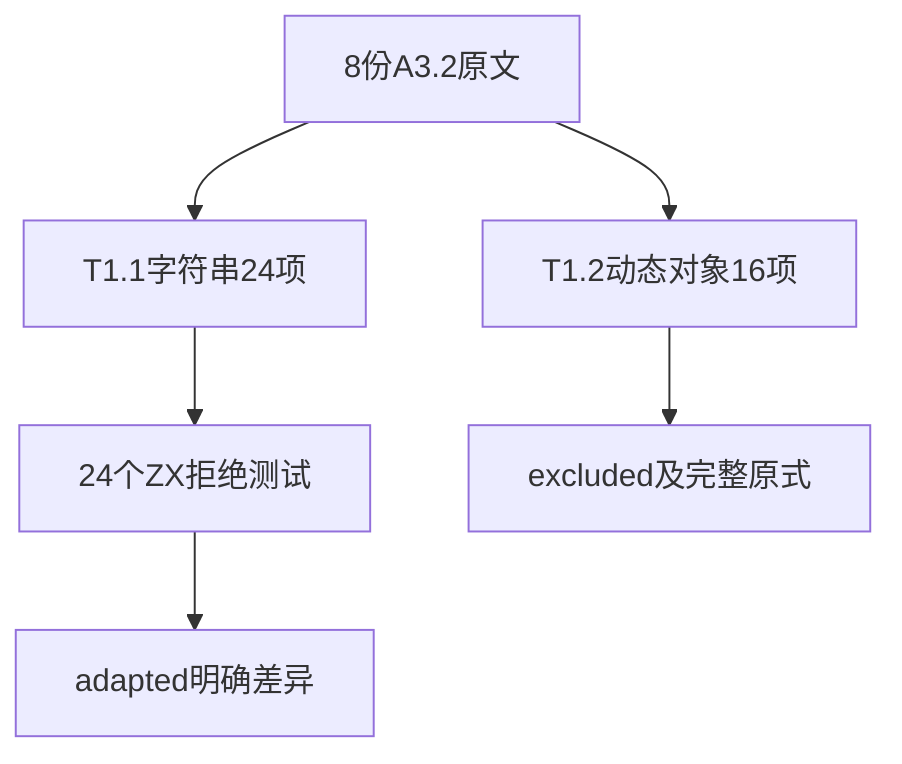
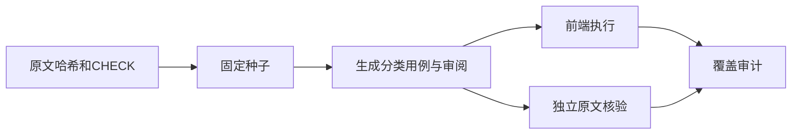

# Test262字符串比较转换审阅

## Intent：最终目标

完整核对四种关系运算符的A3.2原文，区分字符串原始值/包装对象与Object/Function动态toString协议，登记真实边界。

## Data：可用证据

固定Test262提交7ab7fafa0003f73fc85c1b95d88094d33f7eb8bd。本轮8份文件共40个CHECK：四份T1.1各6项字符串比较，四份T1.2各4项原对象比较与显式toString结果一致性断言。

## Edges：边界与限制

ZX字符串不提供关系排序，new包装对象也不受支持。T1.1以静态拒绝适配，不宣称得到JS原布尔结果。T1.2依赖对象/函数动态字符串化，不能用固定字符串或普通字段调用冒充，登记excluded并保留原左右表达式。

## Answer：交付格式与成功标准

新增24个前端用例、8条审阅（4 adapted、4 excluded）。核对全部原文哈希和40个CHECK，仅对T1.1验证ZX拒绝。目录、上游计数和未覆盖边界分列记录。

## 执行结果

新增24前端用例：12个new String表达式在parse/syntax拒绝，12个原始字符串关系表达式在analyze/type_mismatch拒绝。命令 `zig build test-frontend -Dfrontend-filter=relational_string_conversion --summary all` 退出0，5/5步骤、24/24通过；日志 `/tmp/zxc-relational-string-conversion.log`。

另四份T1.2共16项动态协议CHECK已逐项读完并保存原始左侧对象比较及右侧显式toString比较表达式，登记excluded、cases为空。没有给函数源码字符串化虚构固定返回文本，也没有把这16项算作ZX通过案例。

独立脚本核对8个哈希、40个完整原始条件、24项字符串原结果和前端分类，以及4条excluded记录，日志 `/tmp/zxc-relational-string-conversion-review.log` 通过。仅原ASCII字符串的字典序用Python直接比较独立验证，未模拟动态函数/对象协议。

TypeScript、生成--check、目录审计、格式、zig fmt、diff及7份草稿一致性通过。目录63202，前端4647、运行46565不变；上游593/53597（401 adapted、103 equivalent、89 excluded），未审阅53004、关联3708。审计日志 `/tmp/zxc-relational-string-conversion-audit.log`。无生产修改或新实现缺陷。

## 自我批判

源字符串类型存在并不意味着支持字典序；本轮验证拒绝，不能描述为ZX字符串排序通过。动态协议excluded也不是语言实现成功，只是明确记录尚不属于当前ZX契约的测试。原文T1.2保留比较表达式之间的关系，不把右侧表达式推测成一个固定布尔值。

本轮没有新的运行用例，没有重跑全量。原四项legacy身份失败状态不变。后续仍需审阅A2求值/转换顺序及BigInt等文件；不能因A3.1/A3.2完成就宣称关系运算符全部对齐。
