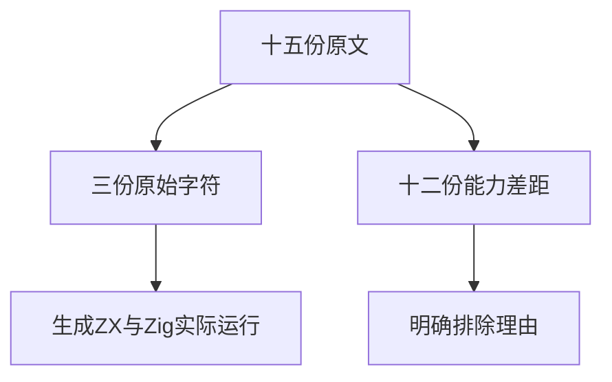
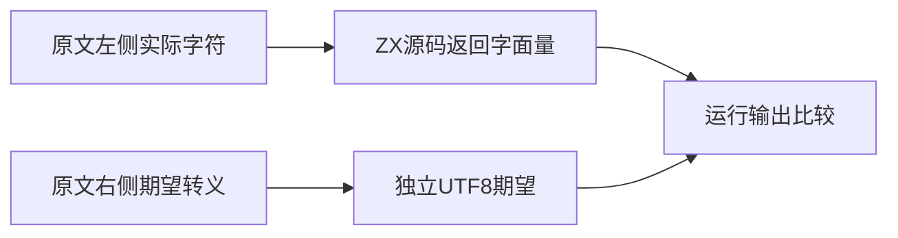

# Test262字符串目录收尾验证

## Intent：最终目标

完成锁定快照字符串字面量目录剩余十五份原文审阅，并将三个原始Unicode源字符接入真实生成程序执行。

## Data：可用证据

逐份读取剩余文件：三份直接源字符、三份eval变体、三个noStrict旧式转义、两份续行、四份Unicode格式负例。原始字符分别为U+2028、U+2029、U+180E，原文主体为双引号中的实际字符，右侧转义只是独立期望表示。

## Edges：边界与限制

三个直接源字符可适配；期望值从原文右侧解码成UTF8供测试比较，不把转义加入ZX。其余十二份excluded，保持eval、旧式模式、续行与Unicode语法能力差距。noStrict原文只执行非严格模式，parse负例不执行。

## Answer：交付与成功标准

三份原文适配加一个运行选择回退对照，共四项运行测试。原文15份SHA/主体、8次仅解析拒绝、19次真实执行通过；新专项、生成一致性、类型、审计与格式通过，并检查该目录不再有未审阅文件。

## 自我复核

本批区分测试主体与期望表示：原始字符用例的主体完整保留，而Unicode转义解码用例本身仍不支持，不能混为一谈。目录审阅完成只代表每份原文有判定，不等于全部支持。

## 阶段302实际结果

原文十五份SHA/主体、8次仅解析拒绝、19次实际执行通过。新运行专项退出0，13/13步骤、4/4测试通过，生成与实际执行验证三个原始Unicode字符及回退值。生成一致性、完整审计、类型、Prettier、Zig格式和diff空白检查通过。

目录64,620（运行47,160、前端5,230），上游1,370/53,597（615适配103等价652排除），未审阅52,227，关联4,537。字符串字面量目录73/73已审阅，剩余0；其中存在明确排除项，不能称为全通过。没有实现缺陷，未向实现会话发消息，未重复完整根。

自我复核：原始Unicode字符保留在生成源码中，期望值来自独立的原文右侧；eval变体没有被这条静态执行路径冒充。新增运行案例和JS原文执行次数分别统计。
