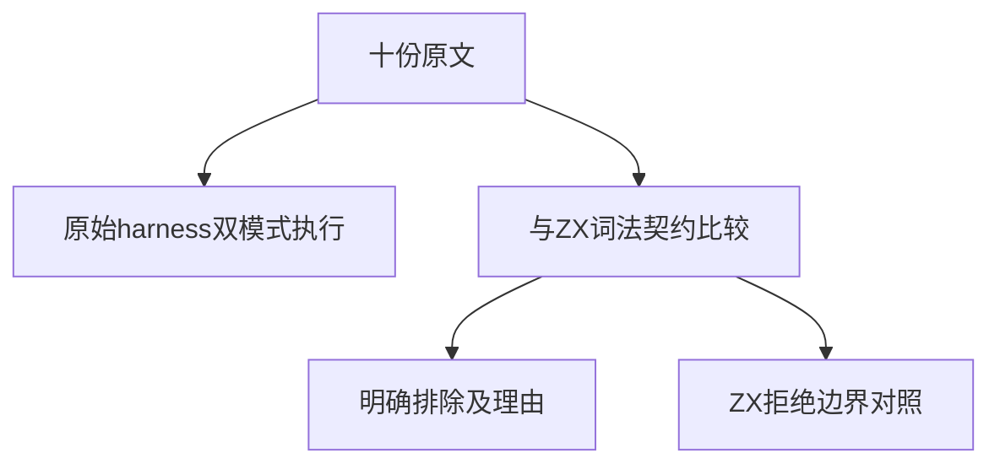
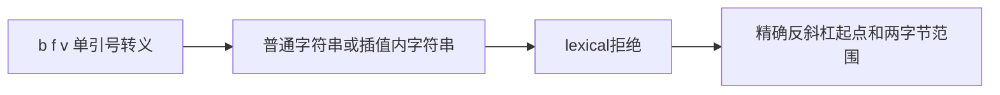

# Test262字符转义差距验证

## Intent：最终目标

核对十份A4.1/A4.2原文，准确登记JS控制字符和identity escape与ZX的语法差距，补齐b/f/v及转义单引号的明确拒绝断言。

## Data：可用证据

逐份原文包含两份标准转义集合，以及英文字母大小写、俄文字母大小写各两份非转义字符断言。当前lex.zig只接受引号、反斜杠、n/r/t；已有identity_q负例支撑非转义字母拒绝，新增四种escape覆盖此前缺口。

## Edges：边界与限制

十份均excluded：部分n/r/t通过不能替代原文对b/f/v的完整要求；原文JS成功不等于ZX成功。新增ZX测试验证当前语言契约，不登记为同语义适配。原文均无negative标记，普通及strict分别真实执行。

## Answer：交付与成功标准

八项新增词法断言覆盖普通返回和模板插值中的四种转义，检查两字节诊断跨度。原文SHA、目录审计、完整前端、生成一致性、类型和格式全部通过后更新计数。

## 自我复核

identity escape的完整字母表在JS中成立，ZX采取拒绝策略；不得以反向拒绝冒充适配。使用现有生成器添加语义缺口，不复制整个字母表来扩大测试数。

## 阶段299实际结果

十份原文SHA/主体、20次双模式执行通过。完整前端退出0，5/5步骤、5,222/5,222测试通过，净增8项。生成一致性、审计、TypeScript类型检查、格式与diff检查通过。

目录64,608（前端5,222），上游1,334/53,597（610适配103等价621排除），未审阅52,263，关联4,534。新增拒绝测试不代表十份原文被ZX支持。没有实现缺陷，未发送消息，未重复完整根。
