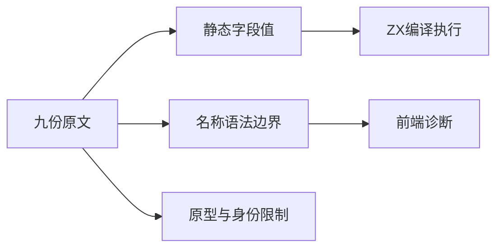
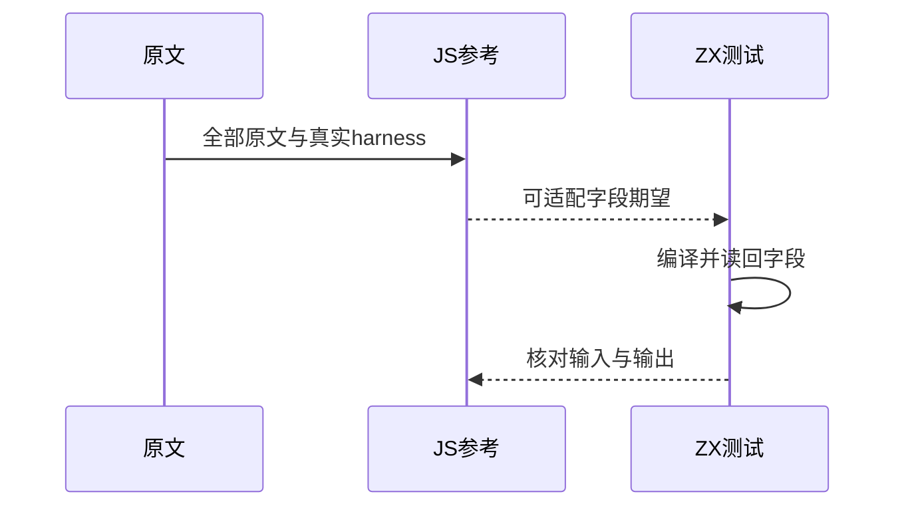

# Test262对象字段名称与值传递

## Intent：最终目标

核验普通对象字段的名称和值传递，补充相同类型下显式字段与简写字段的运行结果。

## Data：可用证据

完整读取固定版本的九份S11.1.5原文；保存SHA256和正文。当前parser_expressions.zig对象分支使用name解析字段名，缺省冒号时读取同名绑定。

## Edges：边界与限制

不把原型、装箱对象与引用身份断言改写成普通值测试。简写是ZX补充，不归入这些上游文件的覆盖。Context相关测试停止，不运行完整入口。

## Answer：交付与成功标准

分类型生成真实字段读回测试，保留不支持名称的原始表达式和精确诊断。执行固定上游原文和独立JS字段读回对照，检查生成一致性、类型与审计。

## 实际结果

新增31案例：24运行时（bool/u64/string/optional四类型的显式与简写字段22项，undefined字段名2项）；7前端（数字、字符串、混合名称、带引号true/null及关键字true/null）。九份原文登记8适配、1排除。A2仅对应CHECK1/3/5/8，装箱和对象身份未覆盖。简写11项是ZX原生补充，不计入这些上游文件的关联。

限定命令 `zig build test-object-construction test-frontend -Dfrontend-filter=language/types/object_fields --summary all`：69/69步骤48/48通过，31新增、17既有。日志 `/tmp/zxc-object-fields-final.log`。

真实sta/assert执行九份原文（40个CHECK块）；根据实际ZX构造表达式独立计算24个JS字段读回结果。原文哈希、完整body均已核对。日志 `/tmp/zxc-object-fields-reference.log`。生成器--check、TypeScript检查、覆盖审计和diff/fmt检查通过；未执行Context相关测试或完整入口。

目录63522（前端4845、普通运行46627）；上游744/53597（464适配、103等价、177排除），剩余52853，关联3925。

## 自我复核与差异处理

首轮错误地推断true/null能作为标识符字段名，实际运行报syntax。进一步核实lex将其标记keyword，parser.name只接受identifier；据此移除本轮新建的四条不适用运行数据，保存两个原始构造表达式的精确语法拒绝。没有更改编译器让特定测试通过。这是上游语法能力差异，现有契约不足以断言它属于实现缺陷，已将复现、根因与待评估范围发送实现会话。

undefined字段名不等于undefined值；后者在此前测试中为未定义名称。optional null只证明空值传递，不意味着JS任意类型字段与装箱对象已支持。动态字符串索引、原型及引用身份仍未验证。

曾误用pnpm audit触发包安全审计，镜像无该接口；随后明确运行 `node packages/test/src/audit_matrix.ts`，覆盖审计成功。没有把失败命令记作通过。21份正式文件与草稿副本字节一致，生成器及原文证据保留供复核。
