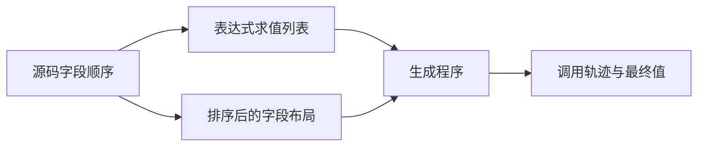
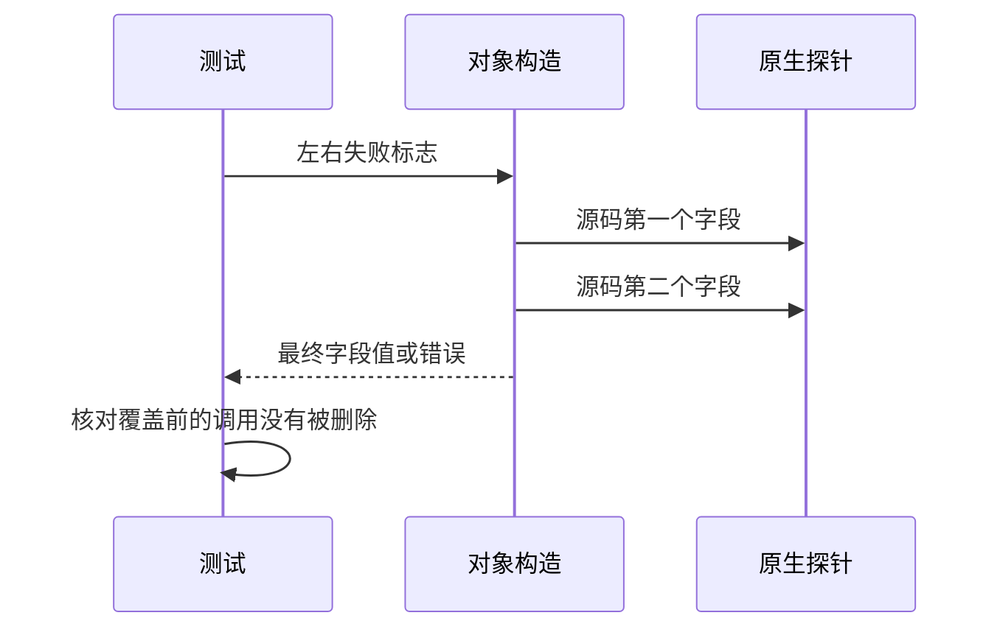

# Test262对象构造与求值顺序

## Intent：最终目标

验证对象合并、覆盖结果及源码字段求值顺序，防止类型字段排序改变调用和异常顺序。

## Data：可用证据

已读取Test262 array目录两个实际含对象spread的原文：多对象合并、spread覆盖先前显式字段。ZX aggregates.object另存evaluation列表与字段布局，需运行验证其区别。沿用native调用轨迹夹具和control运行器。

## Edges：边界与限制

仅适配原文8项字段值检查，不声称支持Object.keys或Function.apply调用机制。另行验证ZX对象字段顺序，不能冒充JS OwnPropertyKeys/getter/Symbol协议。Context测试继续停止。

## Answer：交付与成功标准

6项真实字段值检查、2项旧所有者拒绝边界，加正向/逆序字段、嵌套对象、重复字段以及spread覆盖前后位置的调用轨迹矩阵；同时验证返回值与精确异常。所有检查通过才记录结果。

## 实际结果

新增44个案例：6个普通执行字段值、36个原生调用轨迹、2个旧所有者读取ownership诊断。正向、逆序、嵌套字段各8种（左右失败×选择字段），重复字段、展开在前、展开在后各4种（左右失败）。后续覆盖没有删除被覆盖表达式的调用，左错误只记录L、右错误记录LR，返回最终字段值符合预期。

两个Test262原文保留对象spread及数组包装，移除不支持的apply包装后逐字段观察；6项数值实际执行。原文另两项读取展开前源对象，首次适配运行触发ZX所有权错误。核对IR契约的所有者消费规则后，分离为两个明确ownership负例，没有为了通过而复制对象、提前保存字段或降低所有权规则。该差异不是新生产缺陷。

`zig build test-object-construction test-object-evaluation-order test-frontend -Dfrontend-filter=language/types/object_construction --summary all`：47/47步骤44/44通过，日志 `/tmp/zxc-object-construction-final.log`。原始失败日志 `/tmp/zxc-object-construction.log` 保留了适配边界发现。生成器--check、TypeScript、审计和构建文件格式检查通过，日志 `/tmp/zxc-object-construction-{check,typecheck,audit}.log`。

独立参考脚本验证2份原文SHA256和12个原文assert；核对6个运行预期，并用真实JS对象构造函数执行36种观测轨迹，与目录一致。日志 `/tmp/zxc-object-construction-reference.log`。JS中的旧源对象可读，不将其参考执行通过算作ZX数值覆盖。

目录63434（前端4792、普通运行46592、轨迹904），上游691/53597（439适配、103等价、149排除），剩余52906、关联3880。19份生成文件草稿与正式版本逐字节一致，本次diff通过。

## 自我复核

不能由静态对象字段顺序推断JS动态OwnPropertyKeys/getter/Symbol行为。原型枚举和调用次数包装未移植；独立原生轨迹是ZX能力扩展，不建立虚假上游关联。测试没有硬编码生产行为，实际调用探针并动态选择最终字段。未修改生产代码，未运行Context或完整test入口。
