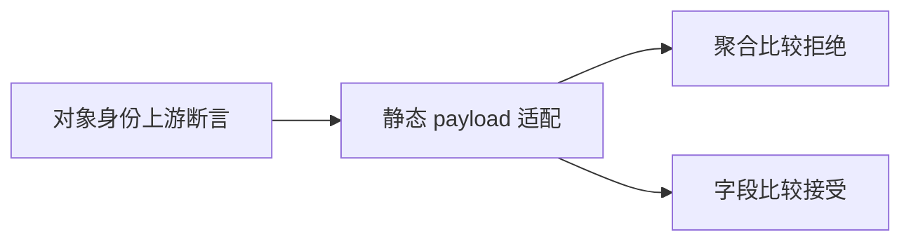

# Test262 对象相等边界验证

## IDEA

- Intent：核查对象身份相等的上游断言，并验证 ZX 即使遇到同对象或别名也不开放聚合相等。
- Data：固定快照 strict-equals/strict-does-not-equals 的 A7 各八项；IR 契约拒绝对象/列表深相等；已有类型矩阵只覆盖独立输入字段。
- Edges：ZX 无 JS 装箱对象身份比较；用静态 payload 对象保留原操作数值和类型，再验证 type_mismatch。此适配记录设计差异，不能当成对象引用相等实现。新增字段标量比较必须通过，排除对象类型本身不可解析导致的假阳性。
- Answer：八种上游形态各两操作、同对象/列表与别名边界、字段对照、两条带 SHA 的审阅记录和前端专项证据。

## 执行计划

1. 草稿生成静态对象构造、别名和直接输入比较。
2. 补充 bool、f64、string 字段读取对照。
3. 运行前端专项并审计映射与生成一致性。

## 架构

## 数据流

## 执行结果

新增 30 个前端案例：八种上游形态 × 两操作 = 16；自身对象/自身列表/列表别名/独立列表 × 两操作 = 8；三种字段类型 × 两操作 = 6 个合法对照。聚合比较均为分析期 type_mismatch，字段比较无诊断。

`zig build test-frontend --summary all` 退出 0，5/5 步骤、3,361/3,361 测试通过，日志 `/tmp/zxc-aggregate-equality.log`。类型、生成一致性、审计、格式、diff 与草稿一致性通过。无生产源码修改、无新缺陷。

登记 58,011（frontend 3,361，其余不变）；上游 362/53,597（227 adapted、102 equivalent、33 excluded），未审阅 53,235，唯一关联 1,827。最近完整根仍为阶段 99。本轮无需重跑未改动的执行矩阵。

## 自我批判

- 静态 payload 不是 JS 装箱对象，普通空对象的单字段占位也不是空对象语义实现；对应差异已写进审阅理由。
- 同对象与别名拒绝说明现有类型约束没有特殊放行身份比较，不证明运行期指针身份相同。
- 字段对照仅验证分析接受，本轮没有新增执行案例；已有标量执行测试仍是运行结果证据。
- 同时阅读的 null/undefined/混型上游文件尚未建立完整映射，因此仍保留未审阅，不能随本轮记为完成。
