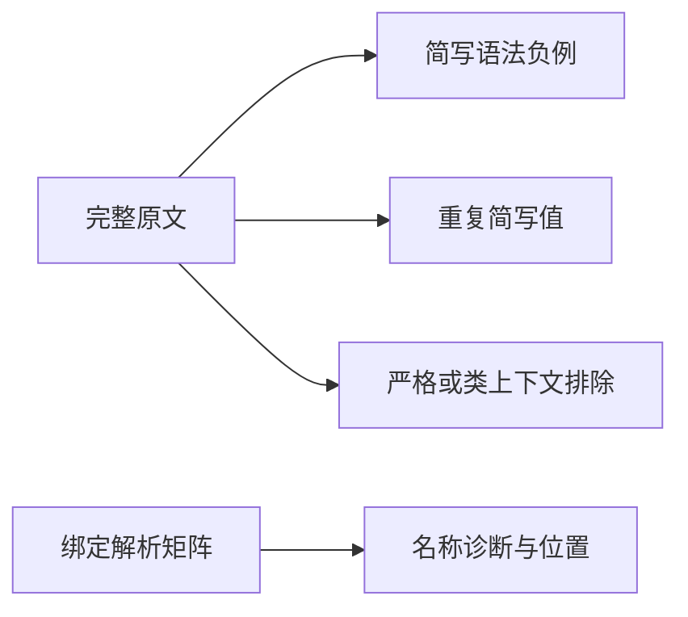
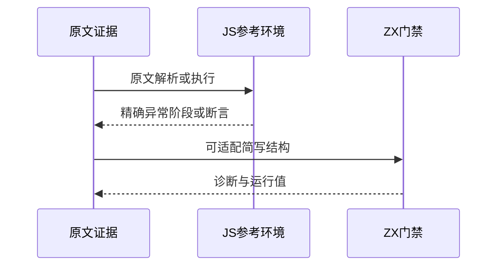
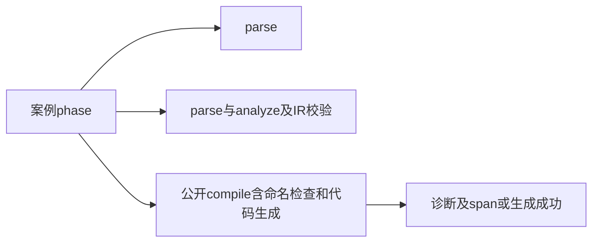

# Test262对象简写与名称解析

## Intent：最终目标

核验对象简写确实读取同名绑定，重复或被覆盖的字段仍参与名称分析；审阅原文早期语法错误及特殊名称重复简写。

## Data：可用证据

完整读取15份原文，保存哈希、body与负例阶段。解析器省略冒号时生成identifier节点；词法器明确把await/let视为关键字。实现会话仍在进行RX类型推导工作，尚无字段名称扩展的完成证据。

## Edges：边界与限制

JS严格模式保留字、类static block上下文与ZX不同，不能删掉上下文后宣称通过。__proto__绑定被ZX命名检查拒绝，不验证其运行值、原型与hasOwnProperty。Context专项继续停止。

## Answer：交付与成功标准

两项原文语法负例、__proto__命名拒绝和原生重复字段值运行、单字段/重复/覆盖/嵌套的绑定与未绑定分析及显式字段标签对照。完整JS原文按负例阶段验证，再独立核验ZX用例的参考表达式。

## 实际结果

新增15项：3条普通value重复简写运行；12条前端（2原文parse syntax，4种结构各有绑定/未绑定8条，1个__proto__命名拒绝及1个显式标签成功对照）。被后续值覆盖的missing简写仍产生名称错误，名称诊断精确指向首次读取。三个运行值和九个普通绑定/标签案例不与本批上游错误关联。

15份上游登记3适配、12排除。完整原文用固定sta/assert验证，12份必须在解析阶段抛SyntaxError，3份执行成功。独立参考再核对4种未定义绑定ReferenceError、5个成功字段值、3个重复字段读回。日志 `/tmp/zxc-object-shorthand-reference.log`。

限定命令 `zig build test-object-construction test-frontend -Dfrontend-filter=language/types/object_shorthand --summary all`：73/73步骤56/56通过，15新增、41既有，日志 `/tmp/zxc-object-shorthand-final.log`。生成器--check、pnpm typecheck、直接node覆盖审计、fmt及本轮范围diff通过。

目录63537（前端4857、普通运行46630）；上游759/53597（467适配、103等价、189排除），剩余52838、关联3928。七份正式文件与草稿字节一致。

## 测试入口补齐

`compiler.analyze`并不执行命名规范检查。为真实检查命名诊断，前端生成器增加已有诊断naming及compile阶段，support在此阶段调用公开compiler.compile并释放Result。旧parse/analyze路径保持独立。新增compile负例检查代码及字节span，正例检查成功生成源码；不把它称为生成代码执行。三个重复字段运行案例另走已有CLI生成与Zig执行链。

## 自我复核

两次边界判断得到纠正：__proto__不能通过项目命名规范；把命名失败放入analyze阶段也不成立。均保留实际失败日志，最终通过独立compile阶段核验，没有更改生产命名规则，也没有将字段重命名后继续关联原上游。

Node vm使用普通{}沙箱时，其继承的__proto__访问器会污染顶层var __proto__参考结果。用Object.create(null)创建沙箱后，未修改的原文通过；通过最小var/简写实验确认差异来自参考容器。原文与固定harness未改写。此修正只针对参考执行环境，不是zxc生产绕过。

严格模式和类static block的12份排除不代表已实现；此前await脚本原文中的函数未调用，不能把它记为字段读回测试。未执行Context或完整测试入口，未发现新的生产契约违例。

全仓diff检查另报告并行实现文件 `packages/compiler/src/analysis/expression_binding.zig:49` 的末尾空行；该文件不属于本轮测试修改，未动它。本轮范围的diff检查通过。
