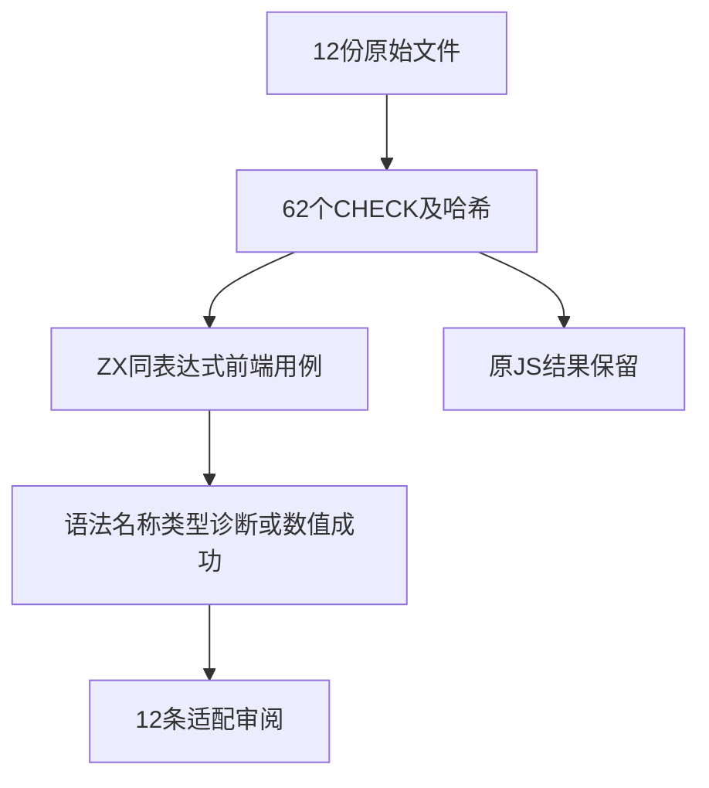
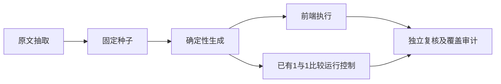

# Test262小于比较转换边界验证

## Intent：最终目标

逐项核对Test262小于比较的12份A3.1转换原文，保留62个表达式，并验证ZX静态边界，避免将拒绝JavaScript隐式转换误称为等价执行。

## Data：可用证据

固定Test262提交7ab7fafa0003f73fc85c1b95d88094d33f7eb8bd，本轮完整阅读S11.8.1_A3.1_T1.1至T1.3、T2.1至T2.9。原始SHA256、CHECK编号、表达式和JS布尔结果存为种子。注意T1.3是Null/Undefined，不能照搬除法同编号的字符串分组。

## Edges：边界与限制

ZX不支持new包装对象，也不进行Boolean/String/Null到Number的隐式转换；undefined不是内置值。测试证明语法/名称/类型边界。仅1<1保留普通数值比较语义，链接既有运行用例验证false。上游登记为adapted并明确差异，不登记equivalent。

## Answer：交付格式与成功标准

新增62个前端用例、12条审阅记录，原文哈希和表达式独立核验。执行过滤前端和既有关系空白运行专项，确认数值控制结果；生成一致性、类型检查、目录审计及草稿一致性通过。

## 执行计划

不扩增相同表达式凑数。每个CHECK保留一项前端案例，数值控制复用已执行案例；逐项记录动态转换不受支持的边界。

## 执行结果

12份原文62个CHECK全部逐项保留。62个新增前端用例结果：36项parse/syntax，17项analyze/type_mismatch，8项analyze/name，1项普通数值比较分析成功。T1.3按原文Null/Undefined处理；没有套用其他运算符同编号分组。

运行命令 `zig build test-frontend test-relational-whitespace -Dfrontend-filter=less_than_conversion --summary all`，退出0，17/17步骤、278/278 Zig通过（新增前端62+既有运行216）。日志 `/tmp/zxc-less-than-conversion.log`。数值控制关联已有less/tab/left/1：shape=0、value=1，实际源码为in.value<1，结果false；216条既有运行案例不计作本轮新增。

`原文校验.py`独立核对12个文件哈希、62个原始表达式与原JS布尔结果、62项前端分类及运行控制的输入/源码/预期。用单独的有限原始值转换解释器计算JS结果，不执行原JS或调用zxc来生成期望；日志 `/tmp/zxc-less-than-conversion-review.log` 通过。TypeScript、生成--check、目录审计、格式、zig fmt、diff及4份草稿一致性通过。

目录新增62至62992，前端4437，普通运行46565不变。上游新增12条adapted，累计549/53597（361 adapted、103 equivalent、85 excluded），尚未审阅53048，唯一关联3498。审计日志 `/tmp/zxc-less-than-conversion-audit.log`；没有生产修改或新实现缺陷。

## 自我批判

原JS的true<true返回false，ZX则拒绝bool关系运算；这不是通过了同一个转换算法。new包装对象被语法拒绝也不证明ToPrimitive顺序，因此审阅只标adapted。T1.2中普通1<1以既有运行案例验证；其余包装对象仍属于明确差异。

独立转换解释器仅适用于本轮已完整阅读的有限输入，不是JavaScript解释器，不能用于推断任意对象、Symbol或BigInt行为。前端诊断分类测试也没有证明完整定位跨度。本轮未重跑全量测试包或仓库根；原四项legacy身份失败状态未改变。
