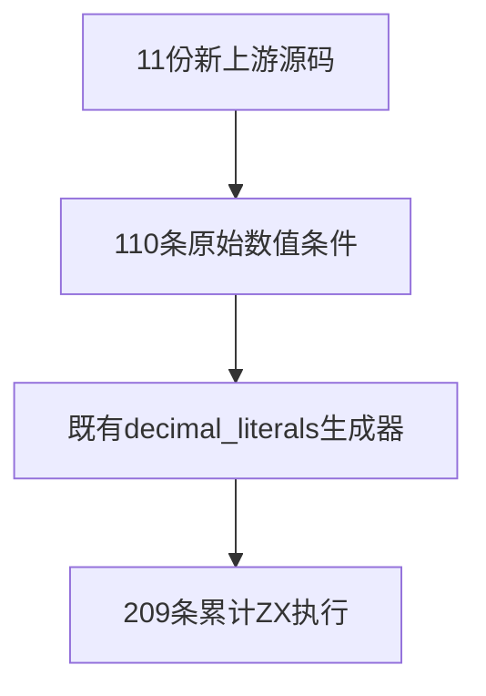
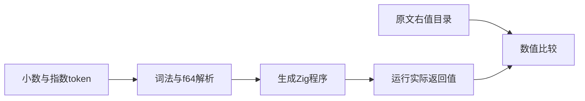

# Test262小数与指数结合验证

## Intent：最终目标

阶段289：验证有完整整数与小数部分的十进制字面量，以及小数与指数结合的值，接续阶段288。

## Data：可用证据

逐份阅读A3.2_T1至T3及A3.4_T1至T8，共11文件110原始条件；ZX lex.zig要求数字起始且小数点后有数字，符合本批语法。上游部分错误消息省略小数数字，提取只采用实际if条件。

## Edges：边界与限制

本轮执行1.0、1.00、1.1等及e/E、正负与零指数，不把不受支持的.1或1.当成同一语法覆盖。这些其他上游文件仍待分别登记。只追加原始数据并复用阶段288生成器与构建注册，不新增框架。

## Answer：交付与成功标准

新增110项实际ZX执行及11条适配，完整十进制专项209项通过；21份累计原文双模式核验、SHA/提取一致性、生成检查及审计通过。

## 验证结果

完整十进制专项13/13步骤、209/209执行通过，其中本轮新增110项。21份累计上游原文42/42普通及严格模式执行通过；全部token/expected与原文实际条件匹配，SHA一致。生成器--check、完整目录审计通过。本轮仅增加数据和生成产物，未改TypeScript或Zig实现，不重复类型与格式检查。

目录64,501（运行47,076、前端5,195、轨迹1,084、隔离464、RX模块10,446、Store236）；上游累计1,277/53,597（599 adapted、103 equivalent、575 excluded），未审阅52,320，关联4,451。

## 自我批判

本批重复的零值形式是上游各语法分支的原始检查，按原始文件与检查序号保持可追踪，未额外排列组合膨胀计数。结果证明完整小数与指数形式的这些有限样本，不证明省略整数或小数部分的语法，也不证明所有浮点舍入边界。未发现实现缺陷，未发送实现消息，未进行全仓回归。
