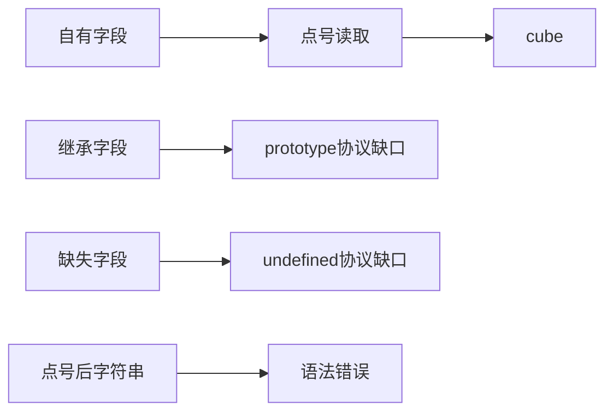
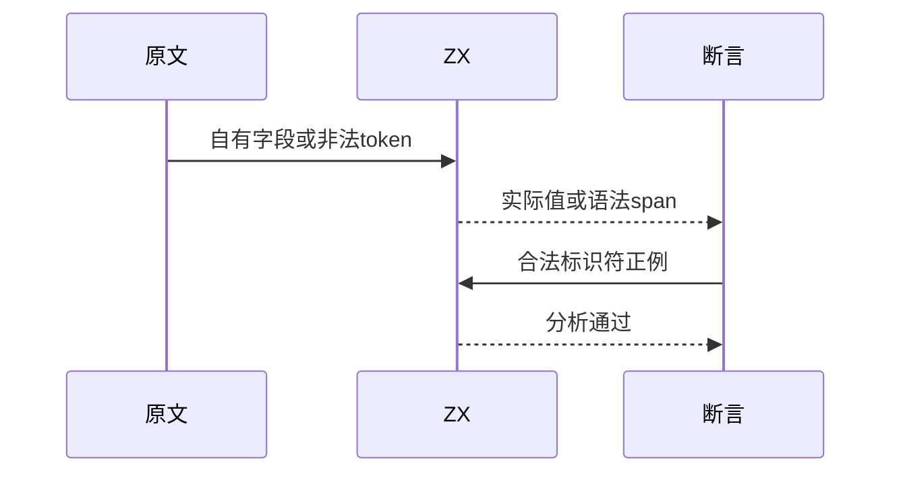

# Test262属性查找与点号边界

## Intent：最终目标

阶段260：审阅自有/继承/缺失属性三协议及点号后非法token，保留可表达行为并明确差异。

## Data：可用证据

完整读取S8.12.3_A1/A2/A3与non-identifier-name。A1继承字段、A2返回undefined不适用；A3自有shape点号值可部分保留；最后一份原文是parse SyntaxError。

## Edges：边界与限制

A3只保留shape:"cube"，删除不支持的数字键，方括号转换不适配。原型及缺失值不替换为静态字段行为。非法token测试保留unresolvableReference名称，必须先解析拒绝，不可依赖名称错误。

## Answer：交付与成功标准

一项自有字段真实运行；点号字符串tokenparse拒绝及合法标识符字段分析正例，共三项。原文哈希、按元数据完整执行/编译、生成/类型/目录审计通过。

## 实际结果

新增一项自有shape读取真实运行与两项前端正反例，17/17步骤、3/3通过。非法表达式保留unresolvableReference，先在parse阶段报syntax，准确指向空字符串token；合法in.shape通过分析，自有对象返回cube。

四原文SHA、三份正常原文双模式共6次执行、语法负例双模式2次SyntaxError通过。直接读取实际ZX函数体与前端表达式的独立参考一致，未执行DONOTEVALUATE。生成--check、类型、审计、格式和注册diff检查通过。

当前64,191案例（运行46,829、前端5,132、轨迹1,084、隔离464、模块10,446、Store236）；上游1,069/53,597（575适配、103等价、391排除），未审阅52,528，关联4,239。属性访问目录当前9/21审阅。

## 自我批判

S8.12.3_A3仅适配第一断言，原数字键及方括号五断言没有验证。继承属性和缺失属性的运行语义明确排除，不能从自有字段成功推断原型链或undefined支持。合法标识符控制检查静态输入字段，原始缺失名字只用于语法负例，不被名称拒绝遮蔽。

没有生产改动、全仓回归或UI验证，无新实现缺陷。
