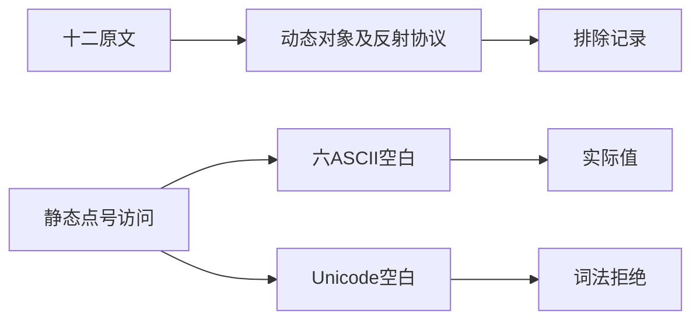
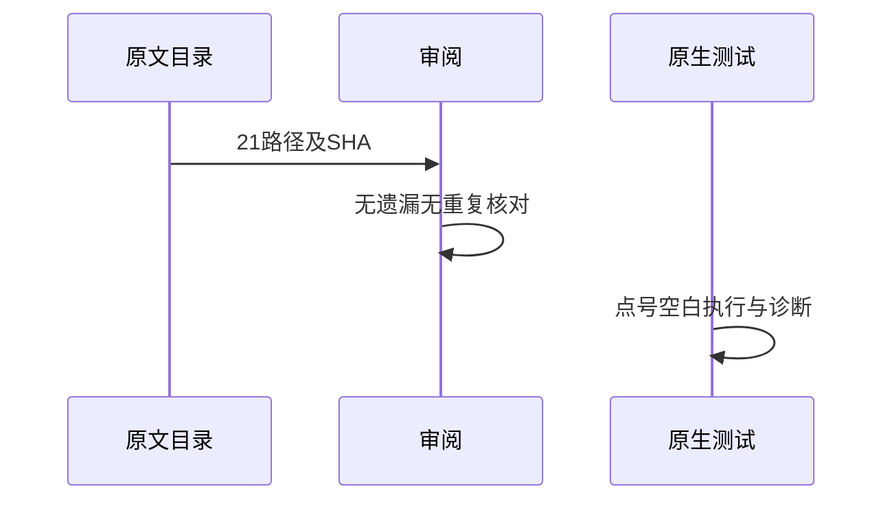

# Test262属性目录审阅收口

## Intent：最终目标

阶段261：完成property-accessors剩余十二文件逐项审阅，并验证当前静态点号访问的空白边界。

## Data：可用证据

完整读取A1.1/A1.2/A2和A4_T1至T9，涉及eval、Number全局属性、运行ReferenceError及this/Object/Function/Array/String/Boolean/Number/Math/Date的typeof属性检查。

## Edges：边界与限制

十二份原文登记excluded，不把同名标准函数或静态字段替代动态对象。新增静态点号空白测试仅为ZX原生覆盖，不关联为原文通过；Unicode词法空白仍明确不支持。

## Answer：交付与成功标准

六种ASCII空白×两个运行值共12项真实执行；四Unicode空白精确拒绝。十二原文哈希和全量双模式执行，21目录审阅集合及哈希完全一致，生成/类型/审计通过。

## 实际结果

新增16项原生边界测试：六种ASCII空白在点号两侧、每形状输入-7/9，共12运行；NBSP/LS/PS/混合Unicode空白4精确lexical拒绝。构建17/17步骤、16/16通过。未将原生案例关联为十二份排除原文的通过案例。

十二原文SHA及strict/sloppy完整24次执行通过，12实际ZX表达式参考值一致，4Unicode表达式在JS合法而ZX拒绝。扫描所有审阅记录，property-accessors21路径完全匹配上游且全部SHA一致：3适配（含部分）、18排除，无重复/遗漏。生成--check、类型、审计、格式及本次注册diff检查通过。

当前64,207案例：运行46,841、前端5,136、轨迹1,084、隔离464、模块10,446、Store236；上游1,081/53,597（575适配、103等价、403排除），未审阅52,516，关联4,239。

## 自我批判

全量审阅的是21份文件；绝大部分动态协议仍未支持。即使ZX标准库提供部分数学或字符串函数，也不能证明Math/String原型属性及typeof断言成立，所以没有按同名功能冒充兼容。

静态点号空白测试证明当前源文本规则，既不验证eval，也不验证Number.POSITIVE_INFINITY全局查找。没有生产改动、全仓回归或UI验证，无新实现缺陷。
