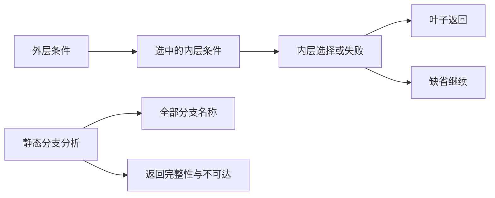
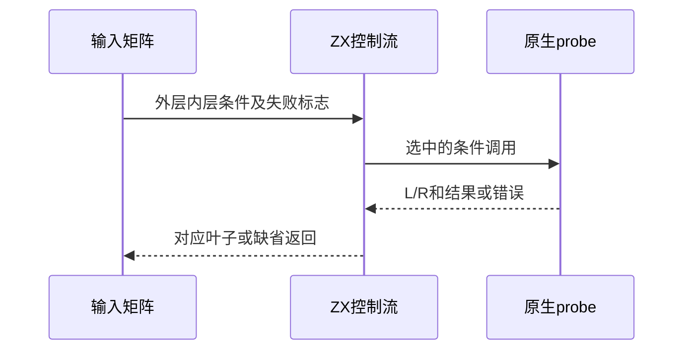

# Test262嵌套条件与返回路径

## Intent：最终目标

验证嵌套if的else归属、else if短路、分支完整返回及静态名称检查，避免运行路径选择掩盖静态错误。

## Data：可用证据

完整读取七份S12.5原文。当前解析器以块表达if分支，else if包装为嵌套块；分析器分别分析yes/no，再以IR terminates检查完整返回。源码已迁至packages/zx/src，此轮以当前文件为准。

## Edges：边界与限制

ZX强制分支块，原文无块写法必须明确加块，不声称实现JS dangling else语法。四种嵌套结构分别保留外层/内层else存在性；函数表达式及真值转换不替换为bool。Context相关测试停止。

## Answer：交付与成功标准

五种控制流形态80个实际运行轨迹；名称绑定、返回路径和非法条件前端矩阵。固定原文与独立JS函数体执行交叉核验，检查每条轨迹及错误。

## 实际结果

新增95项：五种语句形态各16条轨迹，80条；前端8条常量条件两侧名称绑定、6条返回路径、1条if({1})语法边界，共15。四种内外层else组合关联A12_T1至T4；else if轨迹及静态名称/返回路径是ZX补充，不冒充上游内容。

`zig build test-if-evaluation-order test-frontend -Dfrontend-filter=language/statements/if_nested --summary all`：39/39步骤143/143通过（95新增+48既有），日志 `/tmp/zxc-if-nested-final.log`。固定harness执行七份完整原文（1解析错误、6执行成功）；用实际ZX函数体转换为JS控制流，独立核验80项调用轨迹和值/错误。日志 `/tmp/zxc-if-nested-reference.log`。

七上游登记5适配、2排除。生成器--check、类型检查、覆盖审计、fmt和本轮diff通过。目录63700（前端4892、轨迹1032）；上游789/53597（486适配103等价200排除），剩余52808、关联4061。十四份正式文件与草稿字节一致。

## 自我复核

首轮并非生产失败，而是轨迹生成器用{1,8}拒绝零调用。将规则改为{0,8}保留八字节上限和L/R字符限制；运行checker原本已经重置probe.count并精确比较切片，无需放宽。16项外层false且无else的输入要求空轨迹，失败标志也不会制造调用；这些是必要语义，不删用例凑通过。

常量true的单臂返回仍报return_path，是当前结构化返回分析的边界；没有假设常量折叠能补齐静态返回证明。未选中分支的名称错误与运行时跳过该分支并不矛盾，分别通过前端和原生轨迹核验。

A11原文描述把{}泛称为非法，但真实例子是{1}，本轮仅对该非法数字简写作判断。原文无块分支明确改为ZX语句块，不宣称dangling else语法兼容。未修改生产源码，未发现新实现缺陷，未运行Context或完整入口。
