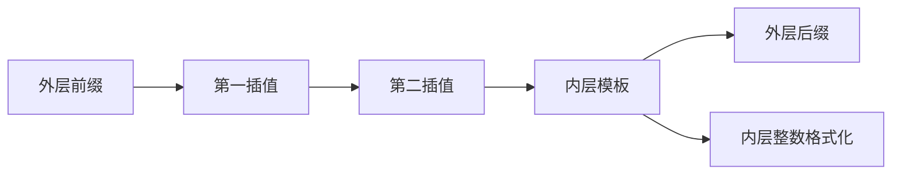
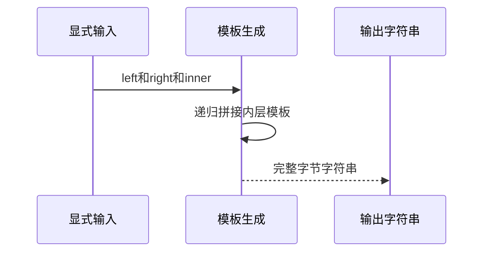

# Test262嵌套模板字符串验证

## Intent：最终目标

保留四份Test262模板原始表达式，验证无插值、嵌套插值及多个前置插值的真实输出，再扩展到动态输入。

## Data：可用证据

完整读取no-sub、literal-expr-template、middle-list-one-expr-template、middle-list-many-expr-template；四份各一条字符串相等断言，无特殊flags/includes。模板解析器、字符串分析和模板生成均支持此ASCII及整数子集。

## Edges：边界与限制

保留完整表达式，不替换成预期字符串；包装ZX显式Input/Output函数，静态原文适配为四运行。动态八项为ZX扩展，不算额外上游文件。不声称tagged/raw、对象ToString、UTF-16或一般浮点格式兼容。

## Answer：交付与成功标准

四原文SHA与完整参考执行、四实际原文表达式运行、八动态负数/零组合输出；独立预期及生成、类型、目录审计。

## 实际结果

四份原文模板表达式完整保留，仅加ZX函数包装；四份哈希与固定索引一致，strict/sloppy完整参考执行各一次，共八次原始断言通过。独立脚本从实际ZX函数体执行四静态和八动态表达式，12项预期全部一致。

实际ZX编译运行：29/29构建步骤、12/12用例通过。动态预期使用独立字段文本列表join构造，覆盖负数与零，不通过复制待验证嵌套模板来生成预期。生成器--check、类型、构建格式、本轮新增文件空白检查通过；13份正式文件与草稿副本逐字一致。

目录审计通过：63,952案例（前端5,044、运行46,694），上游994/53,597（543适配、103等价、348排除），剩52,603，关联4,170。本轮没有执行全量目录，不把审计一致性当作全量运行结果。

## 自我复核

四份原文使用常量嵌套表达式，不能单独证明运行期输入插值，故补八个动态输入。两种语义证据分开计数；八动态组合不增加上游审阅数。只验证ASCII与小整数格式，未推断浮点、对象转换或Unicode完整等价。

未修改生产源码、放宽预期或运行浏览器；Context专项保持已删除。
