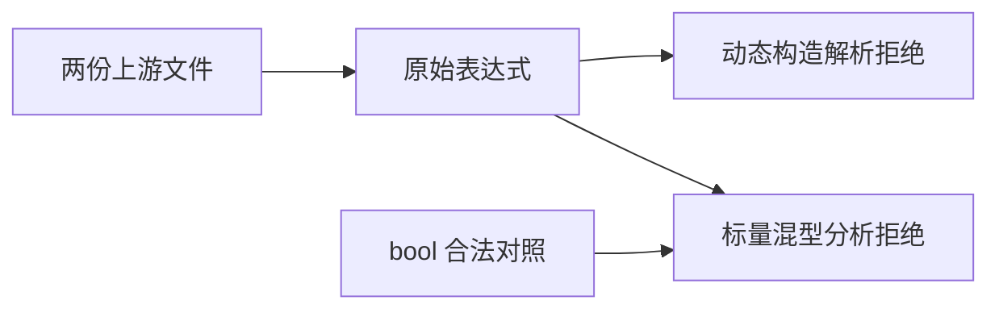
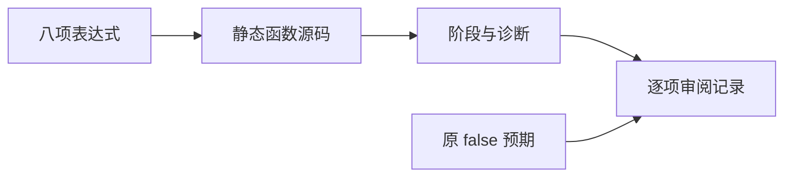

# Test262 布尔不等转换边界

## IDEA

- Intent：完整审阅布尔不等转换中的标量、装箱和 valueOf 分支，不以普通对象替代动态构造后漏掉语法边界。
- Data：does-not-equals/S11.9.2_A3.2 与 A3.3 各四项；同名 equals 文件已审阅，不重复计数。
- Edges：保留原始 new Boolean 与匿名函数对象源码，ZX 不支持这些构造；标量混型在分析期拒绝，动态构造在解析期拒绝。所有上游原预期为 false，与拒绝不是相同结果。
- Answer：八项原表达式、四项标量绑定对照和一个 bool 合法对照；两个 SHA 审阅记录及前端结果。

## 执行计划

1. 编写原始表达式测试，按明确语言边界预期阶段。
2. 对标量另外检查显式绑定形态，防止仅覆盖字面量推断路径。
3. 验证专项、审阅映射和生成一致性。

## 架构

## 数据流

## 执行结果

新增 13 个前端案例：八项原表达式、四项标量绑定形态和一个 bool/bool 合法对照。标量混型分析期 type_mismatch、装箱及匿名函数表达式解析期 syntax 均符合预期。

`zig build test-frontend --summary all` 退出 0，5/5 步骤、3,426/3,426 测试通过，日志 `/tmp/zxc-boolean-inequality.log`。类型、生成一致性、审计、格式、diff 和草稿一致性通过。没有生产源码修改或新缺陷。

登记 61,354（frontend 3,426，其余不变）。上游 370/53,597（235 adapted、102 equivalent、33 excluded），未审阅 53,227，唯一关联 1,884。最近完整根仍阶段 99。

## 自我批判

- 保留原动态构造语法可以直接验证拒绝边界，但不能验证装箱、valueOf 执行或调用次数；这些能力未因测试通过而实现。
- 标量拒绝与上游原 false 结果不同，审阅同时保存原预期，避免混淆。
- 本轮只核对两份尚未审阅文件；已审阅的布尔同型与 equals 转换没有重复计数。
- 合法对照仅验证分析接受，没有新增布尔运行案例；运行语义继续由既有布尔矩阵提供证据。
