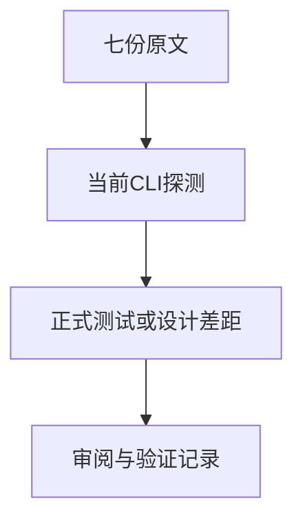

# Test262布尔与空值字面量验证

## Intent：最终目标

核对布尔与null字面量目录全部七份原文，验证当前ZX的实际类型与词法边界，避免把Boolean构造、正则结果或Unicode标识符规则简化成普通常量测试。

## Data：可用证据

逐份读取四份布尔和三份null原文：Boolean(true/false)、null自比较、RegExp未匹配返回null，以及三个Unicode转义关键字parse负例。当前工作区HEAD为46617b2，先构建当前CLI验证，不沿用较早二进制作为当前实现证据。

## Edges：边界与限制

Boolean调用和正则API必须按原文判定，不能删除调用后宣称适配。Unicode关键字负例需要区别“任何转义标识符都不支持”与“支持转义标识符但禁止关键字转义”。null比较如需显式类型，应记录差异。

## Answer：交付与成功标准

先保存当前CLI构建与最小源码探测，再根据实际结果编写正式测试和上游审阅。原文SHA、模式与断言独立核验；有实现契约违约才通知实现会话。

## 自我复核

不能只看文件所在的字面量目录就当作普通字面量测试，必须保留源码实际调用的Boolean和RegExp。暂不预判空值比较一定能编译。

## 当前CLI证据与正式接入

当前源码dist构建成功。探测确认true/false成功、Boolean和RegExp调用为name、无上下文null比较为type_mismatch、Unicode转义关键字为反斜杠处lexical。七份原文全部excluded，理由记录实际调用/类型/词法差距；不会删除调用或补类型后冒称原表达式通过。

正式新增14项前端断言，包含原探测十项及显式可选null、可选值与null比较、普通成员名和转义成员名四个对照。词法错误检查反斜杠单字节精确跨度，其他错误检查诊断类别；正例必须成功分析。

## 阶段303实际结果

当前CLI dist构建成功，14项正式前端断言接入后，完整前端退出0：5/5步骤、5,244/5,244通过。原文七份SHA/主体、6次仅解析拒绝和8次实际执行通过；生成一致性、目录审计、类型、格式与diff检查通过。

目录64,634（前端5,244），上游1,377/53,597（615适配103等价659排除），未审阅52,220，关联4,537。布尔4份、null3份原文均已审阅；它们实际包含的JS调用与无上下文语义仍不支持。没有实现契约缺陷，未向实现会话发送消息。

自我复核：显式可选null和有类型比较的成功对照证明没有把“null不可用”作为过宽结论；Unicode普通成员与保留字一起拒绝，则说明当前只具统一词法限制。没有用轻易通过的常量替代Boolean调用。
