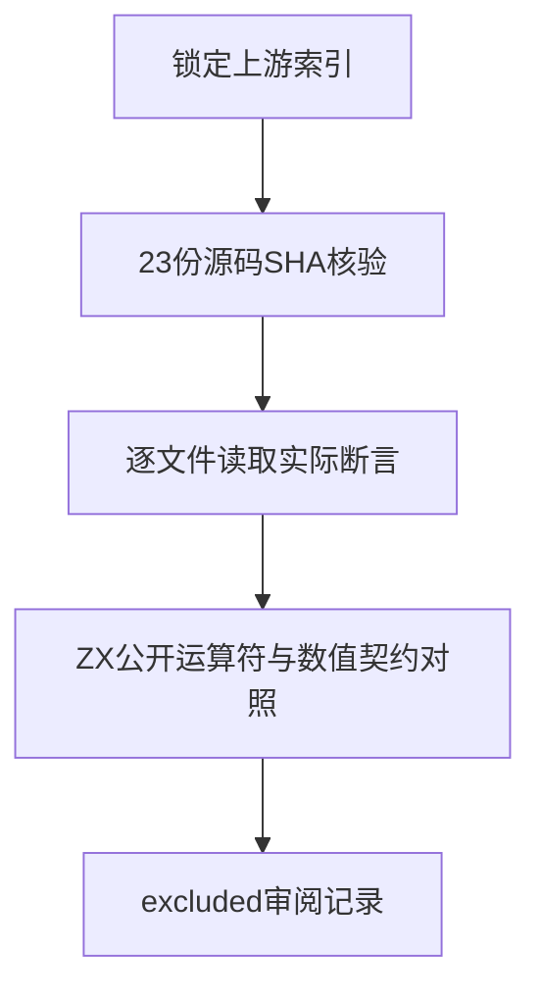
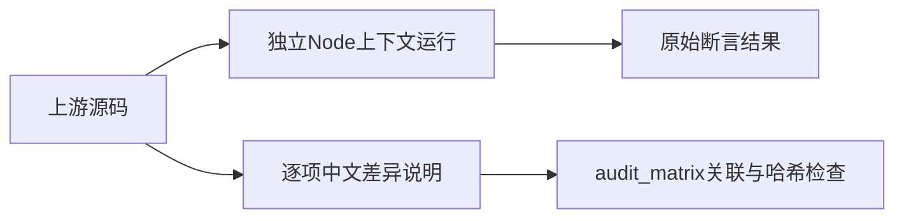

# Test262幂运算数值语义审阅

## Intent：最终目标

阶段286：逐文件核验幂运算A1至A23的实际断言，将当前ZX不支持的语义准确登记为excluded，保留待实现差距，不以审阅数量代替语言兼容性。

## Data：可用证据

锁定上游版本7ab7fafa0003f73fc85c1b95d88094d33f7eb8bd，使用本机既有原始归档。逐份阅读源码并比对上游索引SHA-256；core/src/syntax.zig公开Operator及operators表不含幂运算。当前标准包与转换实现中未找到pow接口。

## Edges：边界与限制

当前契约保留ZX设计，不因上游语法存在而私自扩展运算符。23项原文运行核验只证明上游样本可执行，不是zxc测试。excluded保留未实现语义，不宣称该能力已对齐。A10实际调用Math.pow，不能根据目录名当作星号运算符用例。

## Answer：交付与成功标准

23条逐文件审阅记录，分别记录NaN、带符号零、无穷与非整数指数的行为；SHA匹配，原文断言验证及完整目录审计通过。JSONL执行案例数量保持不变。

## 逐项证据

| 文件编号 | 实际检查 |
| --- | --- |
| A1 | 指数NaN对九种底数得到NaN |
| A2 | 指数正零对九种底数包括NaN得到1 |
| A3 | 指数负零对九种底数包括NaN得到1 |
| A4 | 底数NaN与非零指数得到NaN |
| A5 | 底数绝对值大于1且指数正无穷得到正无穷 |
| A6 | 底数绝对值大于1且指数负无穷得到正零 |
| A7 | 底数绝对值为1且指数正无穷得到NaN |
| A8 | 底数绝对值为1且指数负无穷得到NaN |
| A9 | 底数绝对值小于1且指数正无穷得到正零 |
| A10 | Math.pow对底数绝对值小于1且指数负无穷得到正无穷 |
| A11 | 底数正无穷与正指数得到正无穷 |
| A12 | 底数正无穷与负指数得到正零 |
| A13 | 底数负无穷与正奇数整数指数得到负无穷 |
| A14 | 底数负无穷与正指数且指数不是奇整数得到正无穷 |
| A15 | 底数负无穷与负奇数整数指数得到负零 |
| A16 | 底数负无穷与负指数且指数不是奇整数得到正零 |
| A17 | 底数正零与正指数得到正零 |
| A18 | 底数正零与负指数得到正无穷 |
| A19 | 底数负零与正奇数整数指数得到负零 |
| A20 | 底数负零与正指数且指数不是奇整数得到正零 |
| A21 | 底数负零与负奇数整数指数得到负无穷 |
| A22 | 底数负零与负指数且指数不是奇整数得到正无穷 |
| A23 | 有限负底数与有限非整数指数得到NaN，共4乘8组合 |

## 验证结果

23份源码的SHA-256均匹配索引；独立Node上下文执行23/23原文通过，其中58次sameValue断言及其余原文直接throw检查均完成。A15与A19使用sameValue检查负零，A6/A9/A12/A16/A17等原文使用数值不等比较，未将其夸大为能区分零符号的断言。

完整audit_matrix通过：上游累计1,235/53,597（578 adapted、103 equivalent、554 excluded），未审阅52,362；目录案例64,292、关联4,242不变。幂运算目录共44项，本轮审阅23项，其余尚待逐项审阅。

## 自我批判

该阶段完善了差距登记，没有实现幂运算，也没有增加ZX执行覆盖。被标记excluded的语义仍不能视为兼容成功；后续若语言契约增加幂运算，必须重新打开这些记录并建立真实运行案例。没有将Node执行结果计入zxc测试。原文核验使用轻量sameValue与Test262Error支持，仅适用于本批无需其他harness的样本，不是通用Test262运行器。本轮未跑Zig或全仓回归。
