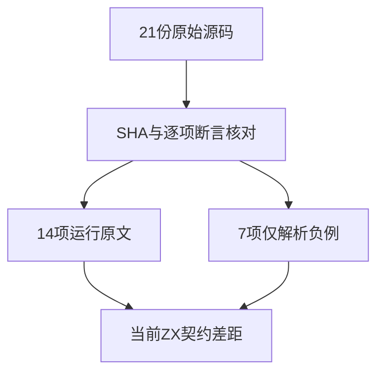
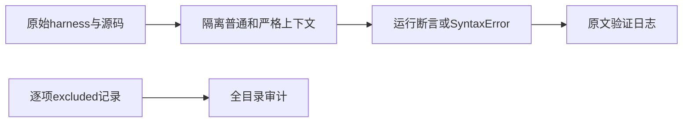

# Test262幂运算目录审阅收口

## Intent：最终目标

阶段287：逐项审阅幂运算目录剩余21份源码，准确区分BigInt、动态转换、求值顺序、复合赋值、优先级和解析期拒绝，完成目录差距登记。

## Data：可用证据

原始锁定版本7ab7fafa0003f73fc85c1b95d88094d33f7eb8bd，逐份读取且SHA与索引一致。ZX公开Operator没有幂，IR数值契约不提供任意精度整数与动态ToNumeric协议。

## Edges：边界与限制

21项均登记excluded，特别是7项parse负例：ZX不支持幂导致拒绝不能证明正确实现ECMAScript一元底数限制。不新增伪等价ZX案例。原文验证与zxc执行计数严格分开。

## Answer：交付与成功标准

新增21条可追溯审阅，完整目录44项均有结论；使用原始Test262 harness对14项正例做普通/严格模式执行，对7项负例只编译验证SyntaxError，42次检查通过；目录审计通过。

## 逐项记录

| 文件 | 语义与差距 |
| --- | --- |
| bigint-and-number.js | BigInt与Number、包装值及可转换原始值混合的20项运行TypeError，ZX没有BigInt或隐式ToNumeric协议 |
| bigint-arithmetic.js | 25项任意精度整数幂，含数千二进制位结果；ZX固定位宽整数不能替代BigInt |
| bigint-errors.js | Symbol及包装Symbol经ToNumeric产生TypeError，含两侧对象转换；ZX没有该动态协议 |
| bigint-negative-exponent-throws.js | 四项BigInt负指数RangeError；不等价于ZX静态语法拒绝 |
| bigint-toprimitive.js | 两侧Symbol.toPrimitive、valueOf、toString优先级、回退、非原始结果及异常传播；ZX无对应动态转换 |
| bigint-wrapped-values.js | 八项包装BigInt及对象转换到BigInt后求幂；ZX没有BigInt包装与拆箱协议 |
| bigint-zero-base-zero-exponent.js | BigInt的0n ** 0n等于1n；ZX无该数值类型及运算 |
| exp-assignment-operator.js | 负底数的**=结果为-27；ZX无幂复合赋值 |
| exp-operator-evaluation-order.js | 先取左右值再依次转换，轨迹left,right,leftValue,rightValue；ZX无幂及valueOf隐式调用 |
| exp-operator-precedence-unary-expression-semantics.js | 幂与括号一元操作、右侧一元操作优先级及右侧一元加号提前转换；ZX无对应幂运算及动态转换 |
| exp-operator-precedence-update-expression-semantics.js | 前后缀增减作为幂底数及幂右结合；ZX无该可变更新表达式协议 |
| exp-operator-syntax-error-bitnot-unary-expression-base.js | 不带括号的~一元表达式作幂底数应在parse阶段SyntaxError；ZX整体不支持**，拒绝原因不同，不能登记等价 |
| exp-operator-syntax-error-delete-unary-expression-base.js | 不带括号的delete一元表达式作幂底数应在parse阶段SyntaxError；ZX整体不支持**，拒绝原因不同，不能登记等价 |
| exp-operator-syntax-error-logical-not-unary-expression-base.js | 不带括号的!一元表达式作幂底数应在parse阶段SyntaxError；ZX整体不支持**，拒绝原因不同，不能登记等价 |
| exp-operator-syntax-error-negate-unary-expression-base.js | 不带括号的-一元表达式作幂底数应在parse阶段SyntaxError；ZX整体不支持**，拒绝原因不同，不能登记等价 |
| exp-operator-syntax-error-plus-unary-expression-base.js | 不带括号的+一元表达式作幂底数应在parse阶段SyntaxError；ZX整体不支持**，拒绝原因不同，不能登记等价 |
| exp-operator-syntax-error-typeof-unary-expression-base.js | 不带括号的typeof一元表达式作幂底数应在parse阶段SyntaxError；ZX整体不支持**，拒绝原因不同，不能登记等价 |
| exp-operator-syntax-error-void-unary-expression-base.js | 不带括号的void一元表达式作幂底数应在parse阶段SyntaxError；ZX整体不支持**，拒绝原因不同，不能登记等价 |
| exp-operator.js | 九项幂基本值、乘除优先级、负指数与右结合；ZX运算符表没有幂 |
| int32_min-exponent.js | 指数-2147483648时2的幂为正零、1的幂为1；ZX无幂运算 |
| order-of-evaluation.js | 六条取值与ToNumeric异常路径分别验证1、12、123、1234轨迹；ZX静态类型拒绝不实现该动态异常顺序 |

## 验证结果

21份新增审阅全部匹配锁定SHA；原文普通/严格模式共42/42检查通过，其中28次真实执行、14次仅解析SyntaxError检查。使用上游原始sta.js及assert.js，异常构造函数身份由同一隔离上下文核验。

完整audit_matrix通过：累计1,256/53,597（578 adapted、103 equivalent、575 excluded），未审阅52,341；JSONL案例64,292、关联4,242不变。独立对比目录文件名集合与审阅集合，幂目录44/44登记完整且无重复。

## 自我批判

审阅完成只是消除未分类差距，44项仍全部excluded，不能据此声称实现幂语义。原文中更新表达式例子的注释和值可能容易误读，本轮以实际表达式、断言及执行为准。没有用ZX的普遍语法拒绝冒充7项特定语法约束的等价实现。没有新增ZX运行测试，没有修改生产实现，也没有执行Zig全仓回归。没有发现既有实现违约，未向实现会话发送消息。
