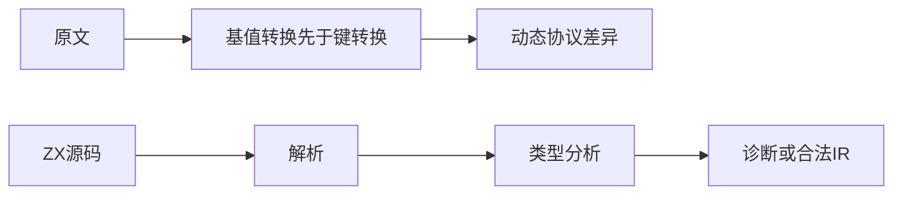
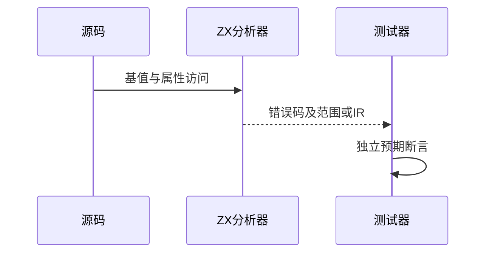

# Test262成员基值与属性键边界

## Intent：最终目标

阶段264：审阅成员表达式空基值与属性键转换顺序，验证ZX静态访问边界。

## Data：可用证据

完整阅读固定快照 computed-reference-null-or-undefined.js；原文两次访问要求ToObject先于ToPropertyKey，键转换不得执行。现有ZX对象点号访问与列表索引实现、前端测试器为本地证据。

## Edges：边界与限制

原文依赖undefined、动态对象键转换及运行TypeError，不能把ZX静态拒绝登记为适配。原文登记excluded表示当前语义差异，不表示需求已经实现。原生对照覆盖null、可选聚合、非法基值和索引类型；合法对照仅验证分析与IR有效性。

## Answer：交付与成功标准

保存原文SHA及完整双模式参考执行证据；新增静态诊断和合法对照，检查阶段、错误码和精确范围；生成一致性、类型检查、目录审计通过。只修改测试包及执行文档。

## 实际结果

14/14测试、5/5构建步骤通过。拒绝覆盖null索引/成员、undefined名字、可选对象索引/成员、可选列表索引、对象字符串键、标量索引、列表字符串键/对象键；合法对照覆盖对象字段、动态u64列表索引、可选对象与列表经合并后访问。

原文SHA256核对、Test262原生harness严格/非严格两次完整执行通过。生成器--check、TypeScript类型检查、目录审计和Zig格式检查通过。目录64,237项：前端5,154、运行46,853，其余不变；上游1,094项：575适配、103等价、416排除，剩余52,503。证据保存在同日成员基值测试草稿目录。

## 自我批判

本轮没有验证动态键转换的运行顺序，也没有实现它；静态类型系统的拒绝只证明ZX自身边界。四个正例验证分析和IR，不宣称生成代码运行结果。十个精确范围当前均为ASCII，Unicode字节定位由其他独立定位套件覆盖。没有编译器缺陷、生产源码修改、全仓回归或浏览器检查。
