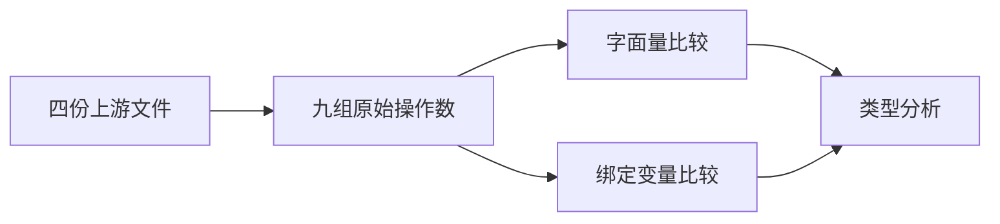
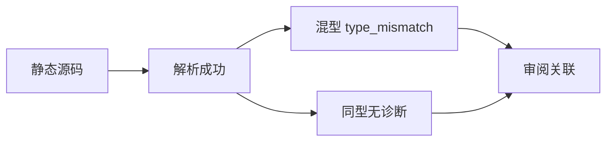

# Test262 数值字符串相等边界

## IDEA

- Intent：逐项审阅抽象相等的数字/字符串转换，并以可执行证据固定 ZX 静态类型差异。
- Data：固定快照 equals/does-not-equals A5.2 各五项、A5.3 各四项；已有同型字符串审阅无需重复。
- Edges：不实现或伪造 JS ToNumber。原 1、1.100、255、空串、负数、最小次正规十进制输入保留；拒绝结果是设计边界，不是原布尔结果通过。
- Answer：原操作数的字面量与类型明确的绑定变量两种检查，同型合法对照，四条 SHA256 审阅关联及前端结果。

## 执行计划

1. 九组原始操作数分别用于 == 和 !=。
2. 每组测试字面量与绑定变量，加入同型 f64/string 对照。
3. 执行前端专项及目录审计，记录转换差异。

## 架构

## 数据流

## 执行结果

新增 40 个前端案例：九组操作数 × 两操作 × 字面量/绑定形态 = 36 个拒绝，另有四个同型对照。四份上游文件均逐项关联，审阅诊断保留 upstream_expected 原布尔结果，明确它与 ZX 的拒绝不同。

`zig build test-frontend --summary all` 退出 0，5/5 步骤、3,413/3,413 测试通过，日志 `/tmp/zxc-equality-conversion.log`。类型、生成一致性、审计、格式、diff 与草稿一致性通过。无生产源码修改或新缺陷。

登记累计 61,341（frontend 3,413，其余不变）。上游 368/53,597（233 adapted、102 equivalent、33 excluded），未审阅 53,229，唯一关联 1,871。最近完整根仍阶段 99。

## 自我批判

- 混型拒绝是静态语言设计边界，不是完成 JS ToNumber；使用 adapted 并保留原布尔值避免混淆。
- 分析期拒绝说明解析成功，但不证明任何运行时转换或运行结果。
- 相同数据的字面量与绑定形态用于排除类型提示路径差异，不将其称为新的上游断言。
- 本轮没有扩张同型字符串已审阅集合，也没有重复增加其审阅数。
