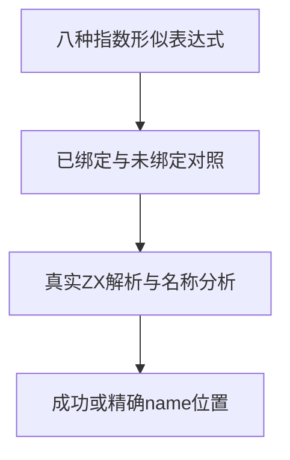
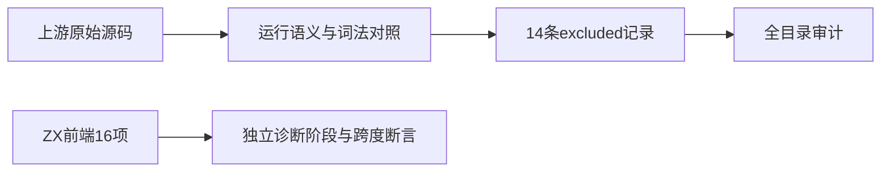

# Test262数字与标识符边界验证

## Intent：最终目标

阶段290：区分指数形似文本的标识符分析与实际数字词法，并记录已读小数省略语法的边界。

## Data：可用证据

八份A4.1原文对e1、E1、e-1、E-1、e+1、E+1、e0、E0期待运行ReferenceError。A2.1三份使用前导小数点，A3.1两份使用尾随点，A3.3_T1使用点后直接指数，ZX lexer对数字起始和点后数字有明确要求。

## Edges：边界与限制

上游14份均登记excluded，不把静态name诊断视为运行ReferenceError等价。新增16项ZX前端对照：八种表达式各有已绑定成功与未绑定name定位，验证当前名称规则；不计作上游运行适配。

## Answer：交付与成功标准

新增可重建前端目录及原文差异记录，16项对照和全前端回归通过，原文双模式及SHA核验，审计通过。

## 验证结果

完整前端回归5/5构建步骤、5,211/5,211测试通过，包含本轮16项已绑定/未绑定对照。14份上游原文普通及严格模式28/28执行通过，SHA匹配。生成器--check、TypeScript类型检查、完整目录审计、Zig格式与相关diff空白检查通过。

目录64,517（运行47,076、前端5,211、轨迹1,084、隔离464、RX模块10,446、Store236）；上游1,291/53,597（599 adapted、103 equivalent、589 excluded），未审阅52,306，关联4,451不变。

## 自我批判

绑定成功对照防止把任何含e的文本都误判成非法指数；未绑定对照检查具体name跨度，避免词法拒绝被当成通过。新增前端案例没有关联为上游等价运行行为，故关联数量不变。省略数字的小数形式根据实际lexer规则记录差异，本轮没有宣称对应数字值已执行。没有实现缺陷，未发送实现消息；完整前端通过不代表全仓通过。
