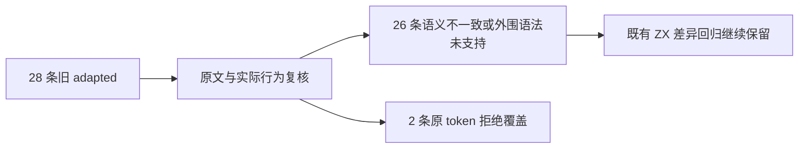
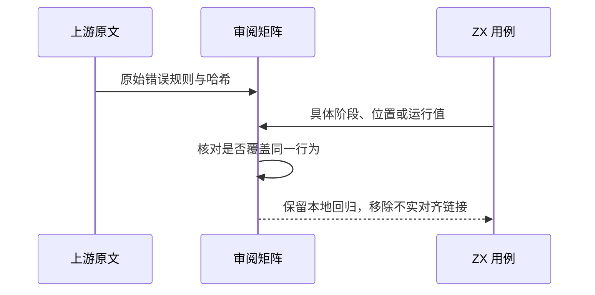

# Test262 数字分隔符旧记录复核

## Intent：最终目标

阶段三百一十六：纠正旧记录中把本语言差异测试统一标为上游适配的问题，使统计真正反映语义覆盖。

## Data：可用证据

复核 numeric_remaining.jsonl 既有 28 条记录、锁定原文、ZX 数值契约与对应本地诊断/运行用例。原文均为 parse 负例。九个进制前缀、六个点号附近形式、十一个前导零形式不具有可直接复用的原文规则覆盖。

## Edges：边界与限制

九个进制前缀整体不支持；三个点后名称被当成字段访问后在分析期拒绝；三个前导点形式没有合法同形支持。十一个前导零形式在 ZX 合法，在原文非法。保留双下划线与数字内 Unicode 转义两条 adapted，限于原 token 的拒绝，不声称全部数值语法等价。

## Answer：交付格式与成功标准

26 条改为 excluded 并解除上游对齐链接，保留所有 ZX 回归测试。两条保留适配与具体诊断记录。原文哈希与正文核验、官方 harness 解析验证及矩阵审计通过后登记结果。

## 自我复核

此阶段减少适配数量，不以数字增长代替质量。没有修改生产语义或删除回归测试；仅改变审阅结论，不能将原文解析验证说成新执行了 ZX 回归。

## 验证结果

28 个原文哈希及正文核验通过，官方 harness 在普通和严格模式下共 56 次仅解析拒绝通过。矩阵审计通过：已审阅总数仍为 1738，其中 599 adapted、103 equivalent、1036 excluded；关联用例由 4663 降为 4622。JSONL 仍为 64760，没有删除本地用例。

本次只改审阅数据，未重跑 ZX 运行和前端专项；未发现生产实现缺陷，未通知实现聊天。保留前后记录及参考核验脚本，旧文档增加更正入口。
